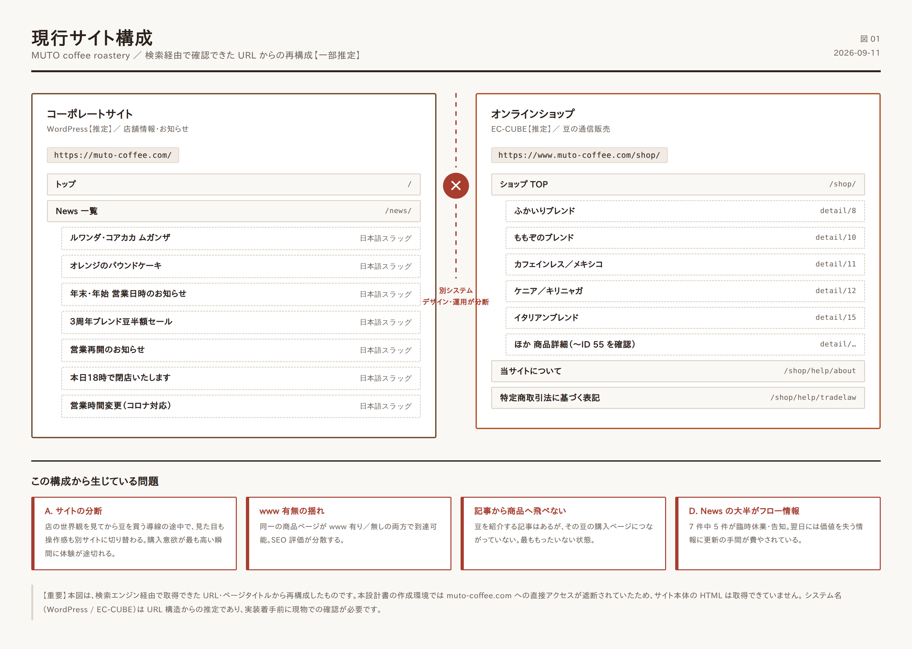
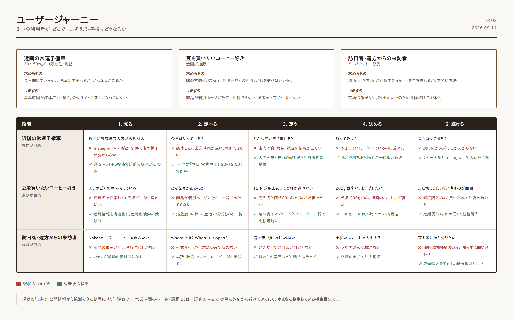

# 01. 現状分析と課題

## 1. 事業・店舗のプロフィール

| 項目 | 内容 | 確度 |
|---|---|---|
| 店名 | MUTO coffee roastery（ムトウ コーヒー ロースタリー） | 【確認済】 |
| 運営会社 | 株式会社 Lounge M | 【確認済】特商法表記 |
| 代表 | 武藤 修一郎 | 【確認済】 |
| 所在地 | 〒164-0001 東京都中野区中野3-34-18 | 【確認済】 |
| 電話 | 03-6382-5439 | 【確認済】 |
| 開業 | 2014年10月3日 | 【確認済】中野経済新聞 |
| アクセス | JR中央線・東京メトロ東西線 中野駅 南口 徒歩2〜3分／中野マルイ裏、れんが坂を上って左 | 【確認済】 |
| 営業時間 | 11:30〜19:00（L.O. 18:00） | 【要確認】※後述の不一致あり |
| 定休日 | 水曜・木曜 | 【要確認】※後述の不一致あり |
| 焙煎機 | オランダ GIESEN 社製 | 【確認済】 |
| 豆の品揃え | 常時 10〜15 種類 | 【確認済】 |
| 店主の経歴 | 元 CM プロデューサー。堀口珈琲で焙煎・テイスティングを修業後、地元・中野で開業 | 【確認済】 |
| 公式 Instagram | @mutocoffeeroastery（フォロワー約 482 / 投稿 9 件） | 【確認済】 |
| 公式 Facebook | あり | 【確認済】 |

### この店の強み（設計の出発点）

現状分析の前に、**サイトが伝えきれていない強み**を確認しておきます。改善設計はすべてここに接続します。

1. **毎朝焙煎、常時 10〜15 種類** — ロースタリーとして明確な差別化要素。しかも単一銘柄とオリジナルブレンドの両方を持つ。
2. **トレーサビリティの明示** — 農園名・地区名までを商品名に含めている（例: ケニア／キリニャガ カムワンギ・ファクトリー、ホンジュラス／サンミゲル・デ・セルグァパ）。これはスペシャルティを扱う店として強い訴求材料。
3. **オランダ GIESEN の焙煎機** — 店内で存在感を放つ設備。写真の主役になる。
4. **店主のストーリー** — CM プロデューサーから転身し、堀口珈琲で修業し、地元中野で独立。物語として完成度が高い。
5. **立地の情緒** — 中野駅至近でありながら、れんが坂を上がった路地裏という「隠れ家」の文脈。
6. **10 年以上の営業実績** — 2014 年開業。2026 年時点で 11 年超。

> **これらは第三者媒体（さんたつ、中野経済新聞、号外NET 中野区、無印良品の中野まち歩き記事など）では繰り返し語られています。**
> 一方で、公式サイトからこれらが同じ強度で伝わっているとは言い難い状態です。これが本改善の核心です。

---

## 2. 現状のサイト構成

### 2.1 確認できたページ

| URL | 役割 | 備考 |
|---|---|---|
| `https://muto-coffee.com/` | トップページ | `<title>`: 「MUTO coffee roastery - 中野 / 東京」 |
| `https://muto-coffee.com/news/` | News 一覧 | `<title>`: 「News一覧 \| MUTO coffee roastary」 |
| `https://muto-coffee.com/{日本語スラッグ}/` | News 個別記事 | 例: 「ルワンダ・コアカカ ムガンザ」「オレンジのパウンドケーキ」「年末・年始 営業日時のお知らせ」「３周年ブレンド豆半額セール」「テイク・アウト 始めました。」「営業再開のお知らせ」「営業時間変更（新型コロナウイルス感染拡大防止のため）」 |
| `https://www.muto-coffee.com/shop/` | オンラインショップ TOP | `<title>`: 「MUTO coffee roastery / TOPページ」 |
| `https://www.muto-coffee.com/shop/products/detail/{ID}` | 商品詳細 | ID は 8, 10, 11, 12, 15, 17, 20, 34, 37, 41, 55 などを確認 |
| `https://www.muto-coffee.com/shop/help/about` | 当サイトについて | |
| `https://www.muto-coffee.com/shop/help/tradelaw` | 特定商取引法に基づく表記 | |

（詳細は `data/page_inventory.csv`）

### 2.2 技術構成の推定

| 領域 | 推定 | 根拠 |
|---|---|---|
| コーポレート側 | **WordPress**【推定】 | `/news/` というアーカイブ構造、投稿タイトルが日本語のままスラッグ化されている URL 形式、`{記事名} \| {サイト名}` という標準的な title 構成 |
| ショップ側 | **EC-CUBE**【推定】 | `/shop/products/detail/{ID}`、`/shop/help/about`、`/shop/help/tradelaw` は EC-CUBE の既定 URL 体系と一致 |
| 連携 | **なし、もしくは弱い**【推定】 | 2 システムが別ディレクトリ・別ドメイン表記で並存 |

> **【要確認】** 実装着手前に、WordPress のバージョン・テーマ・プラグイン、EC-CUBE のメジャーバージョン（2系/3系/4系）を必ず確認してください。EC-CUBE 2 系・3 系はすでにサポートが終了しており、**セキュリティ上の重大リスク**になります。ここは「デザイン改善」より優先度が高い可能性があります。

---

## 3. 課題の棚卸し

課題は **影響度（売上・来店への効き方）× 改修コスト** で整理しています。

### 【課題 A】サイトが 2 つに分断されている — 影響度: 最大

**現象**

- コーポレートサイト（`muto-coffee.com`、WordPress 推定）とオンラインショップ（`www.muto-coffee.com/shop/`、EC-CUBE 推定）が別システム。
- しかも **`www` の有無が揺れている**。検索結果には `https://muto-coffee.com/shop/products/detail/41` と `https://www.muto-coffee.com/shop/products/detail/12` の**両方**が出現しており、同一コンテンツが 2 つの URL で到達可能な状態【確認済】。

**何が起きるか**

1. **SEO 評価の分散** — 同じページが www 有り／無しの 2 URL で認識されると、被リンクや評価が分かれます。正規化（canonical / 301）が効いていない疑いがあります。
2. **デザインの断絶** — 「店の世界観を見てから豆を買う」導線の途中で、見た目も操作感も別のサイトに切り替わります。購入意欲が最も高まった瞬間に体験が途切れます。
3. **回遊の消失** — News で紹介した豆（例: 「ルワンダ・コアカカ ムガンザ」の記事）から、その豆の商品ページへ直接つながっていない可能性が高い【推定】。**記事で欲しくさせて、買わせない**という最ももったいない状態です。
4. **運用の二重化** — 新しい豆が入荷するたび、WordPress と EC-CUBE の両方を更新する必要があります。小規模店舗にとってこの手間は致命的で、結果として片方が放置されます。

**対応方針** → `02_サイト設計` §2（統合方針）

---

### 【課題 B】店舗基本情報が一次情報になっていない — 影響度: 大 / コスト: 小

**現象** — 営業時間・定休日が媒体ごとに食い違っています【確認済】。

| 情報源 | 営業時間 | 定休日 |
|---|---|---|
| 複数媒体（多数派） | 11:30〜19:00（L.O. 18:00） | 水曜・木曜 |
| 一部媒体 | 11:30〜19:30（L.O. 19:00） | 木曜＋第1・第3水曜 |

**何が起きるか**

- 「今日やってる？」を調べた客が **閉まっている店に来る／開いている店を諦める**。どちらも直接の機会損失です。
- Google のナレッジパネルや地図サービスは複数ソースを参照するため、**公式サイトの記述が曖昧だと誤った情報が拡散し続けます**。
- 実際、この不一致は本調査の時点で外部から観測できています。つまり**今まさに起きている損失**です。

**対応方針** — 公式サイトに単一の「正」を置き、構造化データ（`LocalBusiness` / `openingHoursSpecification`）で機械可読にする。→ `04_技術要件` §3

これは **コストが小さく効果が確実**。最優先で着手すべき項目です。

---

### 【課題 C】豆を「選べない」 — 影響度: 大

**現象**

- 常時 10〜15 種類という強みに対し、商品ページは `/shop/products/detail/{ID}` に個別に存在するだけ【確認済】。
- 一覧での**絞り込み・比較・並べ替え**の仕組みが確認できません【推定】。
- 商品名は「エチオピア／ゴロ・ペデッサ ナチュラル」のように産地・農園・精製方法まで入っており情報は豊富ですが、**その情報が構造化されていない**（名前の文字列に埋まっている）。

**何が起きるか**

コーヒー豆の通販で客が知りたいのは、突き詰めると次の 4 点です。

1. **どんな味か**（酸味／苦味／コク、フレーバーの方向）
2. **どのくらい深く焙煎されているか**
3. **自分の淹れ方に合うか**（ドリップ／エスプレッソ／フレンチプレス）
4. **どれを選べばいいか**（初めての人向けの指針）

現状は商品名と価格が主で、この 4 点に答える設計になっていない可能性が高い状態です。
結果、**迷った客は買わずに離脱**します。コーヒー通販における最大の離脱ポイントです。

**対応方針** → `02_サイト設計` §5（豆一覧・商品詳細の設計）

---

### 【課題 D】News がストック資産になっていない — 影響度: 中

**現象** — 確認できた News 記事の内訳【確認済】:

| 種別 | 例 | 性質 |
|---|---|---|
| 臨時休業・時短の告知 | 「本日7月26日（火）18時で閉店いたします。」「やむを得ない事情により18時閉店」 | フロー情報（翌日には価値ゼロ） |
| 年末年始の営業案内 | 「年末・年始 営業日時のお知らせ」 | 毎年繰り返される |
| 営業再開・コロナ対応 | 「営業再開のお知らせ」「営業時間変更（新型コロナウイルス感染拡大防止のため）」 | すでに陳腐化 |
| **商品・メニューの紹介** | **「ルワンダ・コアカカ ムガンザ」「オレンジのパウンドケーキ」** | **ストック情報（資産になる）** |
| セール告知 | 「３周年ブレンド豆半額セール」 | フロー情報 |

**何が起きるか**

- 更新頻度は決して低くないのに（2025年10月、12月、2026年1月と継続更新を確認）、**そのほとんどが翌日には価値を失う情報**に費やされています。
- 一方「ルワンダ・コアカカ ムガンザ」のような**豆の紹介記事は検索にヒットしており**、書けば資産になることが実証されています。
- コロナ対応の記事が残り続けているのは、**更新はしているが整理はしていない**状態を示します。訪問者に「情報が古い」という印象を与えます。

**対応方針** — 臨時のお知らせは記事にせず「お知らせバー」で処理し、記事枠は豆・焙煎・淹れ方の資産コンテンツに集中する。→ `02_サイト設計` §7

---

### 【課題 E】SNS が実力に見合っていない — 影響度: 中

**現象** — 公式 Instagram @mutocoffeeroastery は **フォロワー約 482・投稿 9 件**【確認済】。

**何が起きるか**

- 開業 11 年、第三者媒体に何度も取り上げられ、個人ブログのレビューも多数ある店としては、**明らかに小さい数字**です。
- 一方、一般ユーザーによる投稿（「中野【MUTO coffee roastery】混雑度…」「MUTO Coffee Roastery – A Hidden Gem in Nakano!」など英語投稿含む）は継続的に発生しており、**話題にはなっている**【確認済】。
- つまり **需要はあるが受け皿がない**。カフェ・ロースタリー業態において Instagram は主要な発見チャネルであり、ここは伸びしろがそのまま残っています。
- 毎朝焙煎する店には、**毎日撮るべき絵（焙煎中の GIESEN、生豆、焼き上がり、ケーキ）が存在します**。素材に困らない業態です。

**対応方針** — サイト側に Instagram 導線と埋め込みを設け、投稿→サイト→購入の往復を作る。撮影・投稿の運用ルールを定義する。→ `05_実装ロードマップ` §運用設計

---

### 【課題 F】英語対応がない — 影響度: 中

**現象**

- Trip.com、Yelp、Wanderlog、英語の Instagram 投稿など、**訪日外国人による言及が実在**します【確認済】。
- 中野駅周辺は訪日客の多いエリアで、中野ブロードウェイという強い集客装置があります。
- 一方、公式サイトの英語ページは確認できませんでした【推定: 未対応】。

**対応方針** — 全訳ではなく、**訪日客が必要とする情報だけの 1 ページ英語版**（場所・行き方・営業時間・何が飲めるか・豆は買えるか・支払い方法）を用意。費用対効果が非常に高い施策です。→ `02_サイト設計` §8

---

### 【課題 G】title のタイプミス — 影響度: 小 / コスト: 極小

**現象** — News ページの `<title>` が **「MUTO coffee roastary」** となっています【確認済】。正しくは **roastery**。トップページは「MUTO coffee roastery - 中野 / 東京」で正しい表記です。

**何が起きるか** — 検索結果とブラウザのタブに誤字が表示され続けます。実害は小さいものの、**品質にこだわる店のサイトとしては相応しくありません**。修正コストはほぼゼロです。

**対応方針** — WordPress のサイトタイトル設定を修正（作業 5 分）。

---

### 【課題 H】決済手段がクレジットカードのみ — 影響度: 中

**現象** — 特商法表記より、**支払方法はクレジットカードのみ**、ヤマト運輸で 3 営業日以内に発送、配送は国内のみ【確認済】。

**何が起きるか**

- コーヒー豆の EC における主要顧客層には、**コンビニ払い・代引き・各種 QR 決済**を選ぶ層が一定数存在します。
- 特に **Amazon Pay / PayPay** は、カード情報の入力そのものを嫌う層のカゴ落ちを直接的に減らします。
- **定期購入（サブスク）がない**のは、ロースタリーとして最大の取りこぼしです。毎朝焙煎する店の顧客は**必ず定期的に豆を切らす**ため、定期便との相性が構造的に良い業態です。

**対応方針** → `02_サイト設計` §5.4、`05_実装ロードマップ` フェーズ3

---

## 4. 課題の優先度マトリクス

| 課題 | 影響度 | 改修コスト | 優先度 | 着手フェーズ |
|---|---|---|---|---|
| B: 店舗情報の一次情報化 | 大 | 小 | **1** | フェーズ 1 |
| G: title 誤字 | 小 | 極小 | **1** | フェーズ 1 |
| A: サイト分断の解消 | 最大 | 大 | **2** | フェーズ 2 |
| C: 豆を選べる導線 | 大 | 中 | **2** | フェーズ 2 |
| F: 英語 1 ページ | 中 | 小 | **3** | フェーズ 2 |
| D: News の資産化 | 中 | 小（運用） | **3** | フェーズ 2〜継続 |
| E: SNS 連携と運用 | 中 | 小（運用） | **3** | フェーズ 2〜継続 |
| H: 決済・定期購入 | 中 | 中 | **4** | フェーズ 3 |

> **セキュリティに関する注記**
> 【要確認】EC-CUBE のバージョンが 2 系・3 系である場合、サポート終了済みのため**上記すべてに優先して**対応方針の判断が必要です。カード情報を扱う以上、これは経営リスクの問題です。4 系への移行、または外部 EC プラットフォーム（Shopify / STORES / BASE）への移設を検討してください。判断材料は `05_実装ロードマップ` §3 に整理しています。

---

## 5. ユーザー像と現状の体験ギャップ

想定する主要な 3 つの利用者と、現状のつまずきです。

### ペルソナ 1: 近隣の常連予備軍（30〜50代・中野在住／勤務）

- **求めるもの** — 今日開いているか。落ち着いて座れるか。どんな豆があるか。
- **現状のつまずき** — 営業時間が媒体ごとに違う（課題 B）。公式サイトが答えになっていない。
- **改善後** — トップに「本日の営業」を明示。臨時休業はお知らせバーで即時反映。

### ペルソナ 2: 豆を買いたいコーヒー好き（全国・通販）

- **求めるもの** — 味の方向性、焙煎度、自分の抽出器具との相性、どれを選べばいいか。
- **現状のつまずき** — 商品が個別ページに散在し比較できない（課題 C）。記事から商品へ飛べない（課題 A）。
- **改善後** — 焙煎度・フレーバー・産地で絞り込める一覧。味の見える化。飲み比べセット。定期便。

### ペルソナ 3: 訪日客・遠方からの来訪者

- **求めるもの** — 場所、行き方、何が体験できるか、豆を持ち帰れるか、支払い方法。
- **現状のつまずき** — 英語情報がない（課題 F）。路地裏立地のため地図だけでは迷う。
- **改善後** — 英語 1 ページ。駅からの写真つき道順。「れんが坂を上って左」という**目印ベースの案内**。

---

## 6. まとめ — 本改善で狙う変化

| 観点 | 現状 | 改善後 |
|---|---|---|
| サイトの役割 | 存在の告知 | 来店と購入を生む装置 |
| 店舗情報 | 媒体ごとにバラバラ | 公式が唯一の正 |
| 豆の見せ方 | 個別ページに散在 | 選べる・比べられる・迷わない |
| News | 臨時休業の告知 | 豆と焙煎の物語（検索資産） |
| 購入 | カードのみ・都度購入 | 決済多様化・定期便 |
| 対応言語 | 日本語のみ | 日本語＋英語（要点のみ） |
| 運用 | 2 システムを二重更新 | 1 箇所の更新で全面反映 |
