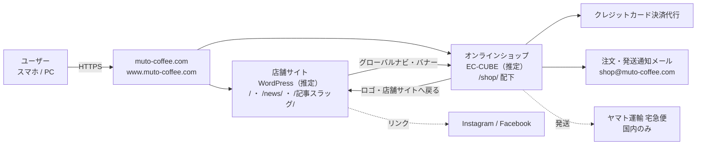
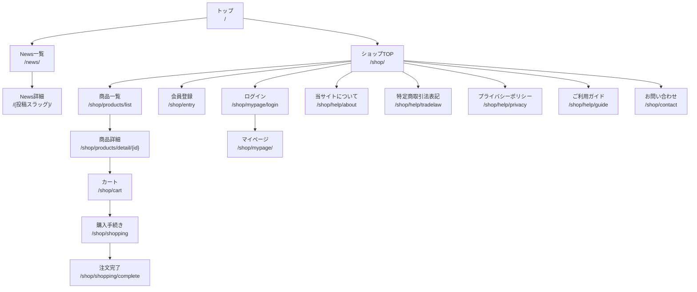

# 02. サイト構成・URL設計

## 1. システム全体構成

| 構成要素 | 内容 | 区分 |
|---|---|---|
| ドメイン | `muto-coffee.com`（店舗サイトは非 www、ショップは `www` 付き URL がインデックスされている） | 確認済 |
| 店舗サイト | WordPress。投稿（News）＋固定ページ（トップ） | 推定 |
| ショップ | EC-CUBE 3 系または 4 系（ルーティングが `/products/detail/{id}` 形式で `.php` を含まないため 2 系ではない） | 推定 |
| 決済 | クレジットカード（決済代行サービス経由と想定） | 確認済（カード可）／代行会社は要確認 |
| 配送 | ヤマト運輸宅急便、国内限定、注文確認後3営業日以内発送 | 確認済 |

## 2. サイトマップ

## 3. ページ一覧

| ID | ページ名 | URL | 領域 | テンプレート | 目的 | 区分 |
|---|---|---|---|---|---|---|
| P-01 | トップ | `/` | 店舗 | front-page | 店舗情報・メニュー・最新 News・ショップ導線 | 確認済 |
| P-02 | News 一覧 | `/news/` | 店舗 | archive | お知らせ・新入荷・セール等の時系列一覧 | 確認済 |
| P-03 | News 詳細 | `/{投稿スラッグ}/` | 店舗 | single | 個別記事。スラッグは投稿タイトル由来の日本語 | 確認済 |
| P-04 | About（店舗・焙煎のこだわり） | `/about/` | 店舗 | page | オーナー・焙煎機・豆の選定方針 | 提案（現行はトップ内セクションの可能性） |
| P-05 | メニュー | `/menu/` | 店舗 | page | 店内メニュー全量 | 提案（現行はトップ内セクション） |
| P-06 | アクセス | `/access/` | 店舗 | page | 地図・経路・営業時間 | 提案（現行はトップ内セクション） |
| P-10 | ショップ TOP | `/shop/` | EC | index | おすすめ・新着商品、会員導線 | 確認済 |
| P-11 | 商品一覧 | `/shop/products/list` | EC | product_list | 全商品・カテゴリ絞り込み・検索結果 | 確認済 |
| P-12 | 商品詳細 | `/shop/products/detail/{id}` | EC | product_detail | 価格、内容量、精製方法、焙煎度、味わい、カート投入 | 確認済 |
| P-13 | カート | `/shop/cart` | EC | cart | 数量変更・削除・小計 | 推定（EC-CUBE 標準） |
| P-14 | 購入手続き | `/shop/shopping` | EC | shopping | 配送先・支払方法・確認 | 推定 |
| P-15 | 注文完了 | `/shop/shopping/complete` | EC | complete | 注文番号表示 | 推定 |
| P-16 | 会員登録 | `/shop/entry` | EC | entry | 新規会員登録 | 確認済（ショップ TOP に「新規会員登録」リンク） |
| P-17 | ログイン | `/shop/mypage/login` | EC | login | 会員ログイン | 確認済（同上「ログイン」） |
| P-18 | マイページ | `/shop/mypage/` | EC | mypage | 注文履歴、会員情報、配送先 | 推定 |
| P-19 | 当サイトについて | `/shop/help/about` | EC | help_about | 店舗紹介・連絡先 | 確認済 |
| P-20 | 特定商取引法に基づく表記 | `/shop/help/tradelaw` | EC | help_tradelaw | 販売業者、責任者、支払・配送条件 | 確認済 |
| P-21 | プライバシーポリシー | `/shop/help/privacy` | EC | help_privacy | 個人情報の取扱い | 要確認 |
| P-22 | ご利用ガイド | `/shop/help/guide` | EC | help_guide | 注文〜到着までの流れ、送料 | 要確認 |
| P-23 | お問い合わせ | `/shop/contact` | EC | contact | 問い合わせフォーム | 要確認 |
| P-24 | 商品検索結果 | `/shop/products/list?name=...` | EC | product_list | キーワード検索 | 推定 |
| P-25 | 404 | `/404` 相当 | 共通 | 404 | 存在しない URL の案内 | 要確認 |

## 4. URL 設計

### 4.1 現状（As-Is）

| 観点 | 現状 | 課題 |
|---|---|---|
| ホスト名 | 店舗サイトは `https://muto-coffee.com/`、ショップは `https://www.muto-coffee.com/shop/...` と `https://muto-coffee.com/shop/...` の両方がインデックスされている | 重複 URL。正規化されていない可能性 |
| News 詳細 | `/年末・年始-営業日時のお知らせ-2/` のようにタイトル由来の日本語スラッグ。同名記事は `-2` が付く | URL が長く、共有時にパーセントエンコードで可読性が落ちる。`/news/` 配下でない |
| 商品詳細 | `/shop/products/detail/{数値ID}` | EC-CUBE 標準。SEO 上は商品名を含まないが、変更コストが高いので維持 |
| 末尾スラッシュ | WordPress 側はスラッシュあり、EC-CUBE 側はなし | フレームワーク差なので許容。リダイレクトで統一 |

### 4.2 目標（To-Be）【提案】

| ルール | 内容 |
|---|---|
| R-01 | 正規ホストを `https://muto-coffee.com` に統一し、`www` と `http` からは 301 リダイレクト |
| R-02 | News 詳細を `/news/{YYYY}/{MM}/{英数字スラッグ}/` に変更。旧 URL からは 301 リダイレクト（既存記事は個別マッピング表を作成） |
| R-03 | News カテゴリ一覧を `/news/category/{info\|arrival\|sale\|sweets}/` で提供 |
| R-04 | ショップは `/shop/` プレフィックスを維持し、EC-CUBE の標準ルートを変更しない |
| R-05 | 固定ページを新設する場合は英小文字スラッグ（`/about/`、`/menu/`、`/access/`） |
| R-06 | 各ページに `<link rel="canonical">` を出力。ショップの商品一覧はソート・ページング用クエリを canonical から除外 |
| R-07 | `sitemap.xml` を店舗サイト・ショップそれぞれで生成し、`robots.txt` から両方を参照 |

### 4.3 リダイレクト対応表（例）

| 旧 URL | 新 URL | 種別 |
|---|---|---|
| `http://muto-coffee.com/*` | `https://muto-coffee.com/*` | 301 |
| `https://www.muto-coffee.com/*` | `https://muto-coffee.com/*` | 301 |
| `/年末・年始-営業日時のお知らせ-2/` | `/news/2025/12/nenmatsu-nenshi-2025/` | 301（個別） |
| `/ルワンダ・コアカカ-ムガンザ/` | `/news/{YYYY}/{MM}/rwanda-koakaka-muganza/` | 301（個別） |

## 5. ナビゲーション設計

### 5.1 グローバルナビゲーション（店舗サイト）

| 順 | ラベル | リンク先 | 備考 |
|---|---|---|---|
| 1 | Home | `/` | ロゴクリックでも遷移 |
| 2 | About | `/about/`（または `/#about`） | 焙煎・オーナー |
| 3 | Menu | `/menu/`（または `/#menu`） | 店内メニュー |
| 4 | News | `/news/` | 一覧 |
| 5 | Access | `/access/`（または `/#access`） | 地図・営業時間 |
| 6 | Online Shop | `/shop/` | 強調ボタン扱い。別システムへの遷移 |

モバイルではハンバーガーメニューに格納し、「Online Shop」と「電話する」は常時表示のフローティングボタンとする【提案】。

### 5.2 グローバルナビゲーション（ショップ）

| 順 | ラベル | リンク先 |
|---|---|---|
| 1 | ロゴ | `/shop/` |
| 2 | 商品一覧 | `/shop/products/list` |
| 3 | ブレンド | `/shop/products/list?category_id={ブレンド}` |
| 4 | シングルオリジン | `/shop/products/list?category_id={シングルオリジン}` |
| 5 | カフェインレス | `/shop/products/list?category_id={カフェインレス}` |
| 6 | 検索窓 | `/shop/products/list?name=` |
| 7 | 新規会員登録／ログイン／マイページ | `/shop/entry`、`/shop/mypage/login`、`/shop/mypage/` |
| 8 | カート（点数バッジ付き） | `/shop/cart` |
| 9 | 店舗サイトへ | `/` |

### 5.3 フッター（共通）

| ブロック | 内容 |
|---|---|
| 店舗情報 | 店名、住所、電話、営業時間、定休日 |
| リンク | About／Menu／News／Access／Online Shop |
| ショップ関連 | 当サイトについて／ご利用ガイド／特定商取引法に基づく表記／プライバシーポリシー／お問い合わせ |
| SNS | Instagram、Facebook（アイコン） |
| コピーライト | `© 2010– MUTO coffee roastery / Lounge M Inc.` |

### 5.4 パンくずリスト

| ページ | 表示 |
|---|---|
| News 詳細 | Home ＞ News ＞ 記事タイトル |
| 商品詳細 | Home ＞ Online Shop ＞ カテゴリ名 ＞ 商品名 |
| ヘルプ系 | Home ＞ Online Shop ＞ ページ名 |

構造化データ `BreadcrumbList` を併せて出力する（05章）。
