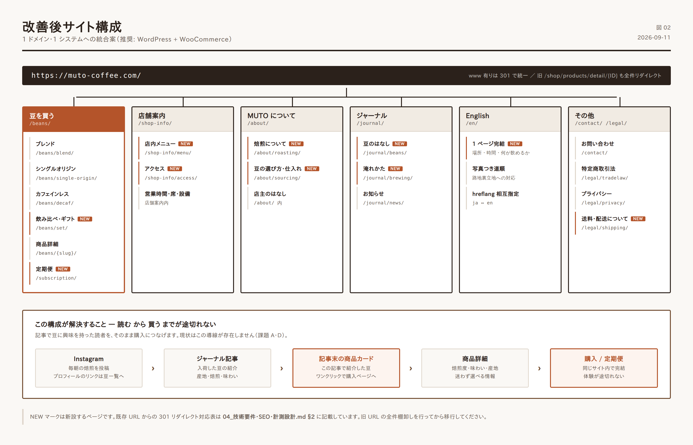
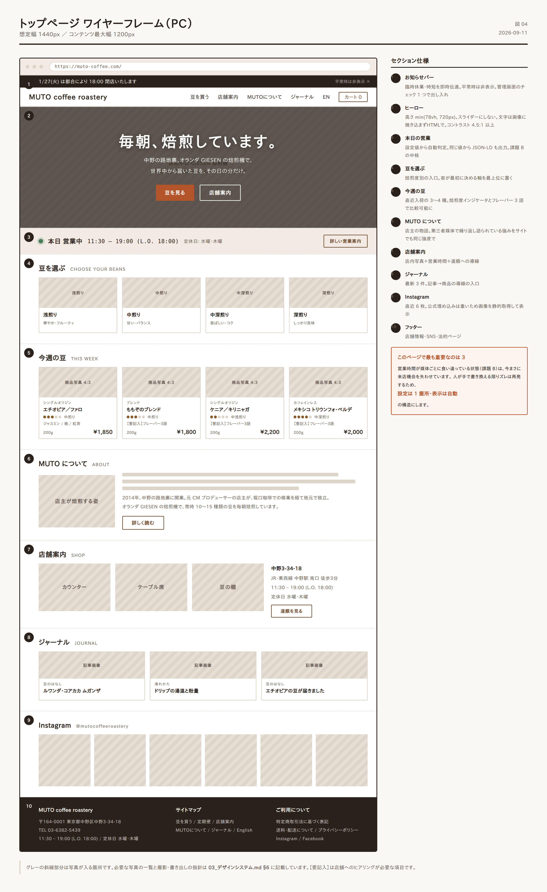
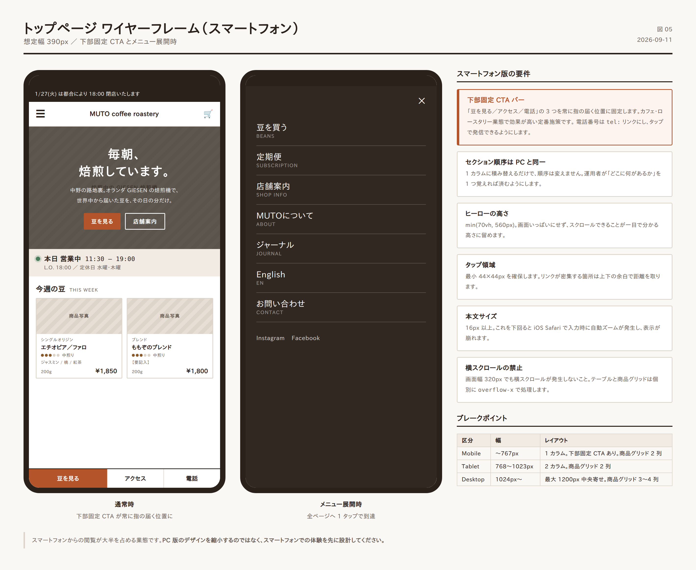
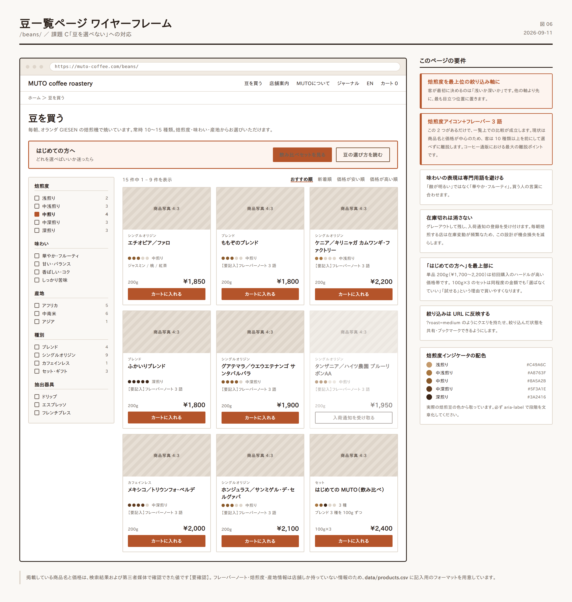
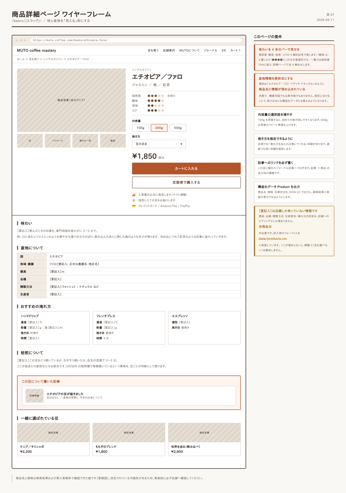
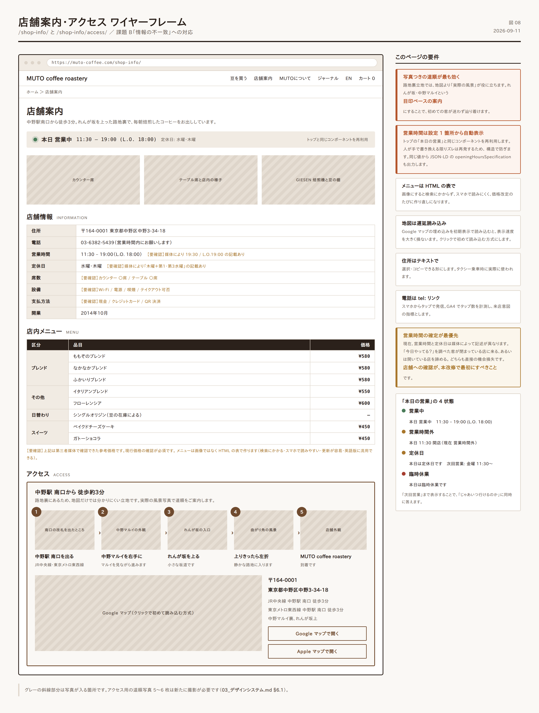

# 02. サイト設計（情報設計・ワイヤーフレーム）

## 1. 設計コンセプト

> ### 「毎朝、焙煎しています。」
> — 店の前を通れば分かることを、Web でも分かるようにする。

MUTO coffee roastery の本質は **ロースタリーであること**です。オランダ GIESEN の焙煎機が店内にあり、毎朝そこで豆が焼かれ、その豆が棚に並び、その場で淹れられ、量り売りで持ち帰れる。この一連の流れが、この店の価値そのものです。

新しいサイトは、この流れをそのまま構造にします。

```
焙煎する  →  並ぶ  →  飲む  →  持ち帰る／届く
 (物語)     (豆一覧)   (店舗)     (購入・定期便)
```

### 設計の 3 原則

| 原則 | 意味 | 具体的な判断基準 |
|---|---|---|
| **1. 迷わせない** | 「今日開いてる？」「どの豆？」に即答する | トップから 2 クリック以内で全情報に到達 |
| **2. 途切れさせない** | 読む→欲しくなる→買う が同一体験 | 記事・豆・購入が同じデザイン言語の中で完結 |
| **3. 静けさを保つ** | 路地裏の隠れ家という実店舗の質感を Web でも守る | 余白を広く、装飾を削り、写真と文字だけで語る |

---

## 2. サイト統合方針【最重要】

課題 A（サイトの分断）への対応です。**3 案を比較し、案 B を推奨します。**

### 案 A: 現構成の維持＋連携強化

| | 内容 |
|---|---|
| 概要 | WordPress と EC-CUBE を残したまま、デザインを揃え相互リンクを強化 |
| コスト | 小（〜50万円規模） |
| メリット | 既存資産・既存 URL をほぼ維持できる。移行リスクが最小 |
| デメリット | **二重運用が残る**。EC-CUBE のバージョンが古い場合、セキュリティ課題も残る。体験の断絶は緩和されるが解消しない |
| 向くケース | EC-CUBE が 4 系で稼働中かつ、当面は現状維持したい場合 |

### 案 B: WordPress + WooCommerce に統合 ★推奨

| | 内容 |
|---|---|
| 概要 | コーポレートとショップを WordPress 側に一本化。EC は WooCommerce で構築し、`muto-coffee.com` 単一ドメインに集約 |
| コスト | 中（80〜150万円規模） |
| メリット | **1 システム・1 デザイン・1 回の更新**。記事から商品への導線が自然に作れる。SEO 評価が 1 ドメインに集約される。定期購入プラグインで サブスク も実現可能 |
| デメリット | EC-CUBE からの商品・顧客データ移行が必要。URL 変更に伴う 301 リダイレクト設計が必須 |
| 向くケース | **本件に最も適合。** 商品点数が 10〜20 点規模で、記事と商品の連動が価値を生む業態 |

### 案 C: Shopify へ全面移行

| | 内容 |
|---|---|
| 概要 | EC の基盤を Shopify にし、コーポレートページも Shopify 上に構築 |
| コスト | 中〜大（100〜200万円＋月額） |
| メリット | 決済・定期購入・在庫・セキュリティを全てプラットフォームが担保。運用負荷が最小 |
| デメリット | 月額費用と決済手数料が継続発生。デザインの自由度がテーマに制約される。記事機能（Shopify Blog）は WordPress より弱い |
| 向くケース | 通販を事業の主軸に据え、拡大を狙う場合 |

### 推奨理由（案 B）

1. **商品点数が 10〜20 点規模** — Shopify のような大規模 EC 基盤は過剰。WooCommerce で十分に扱えます。
2. **記事と商品の連動が本件の価値の中心** — 「ルワンダ・コアカカ ムガンザ」のような豆の紹介記事から、その豆の購入ページへ直結させる。この体験は WordPress + WooCommerce が最も素直に実現できます。
3. **運用者が店主自身である前提** — 焙煎の合間に更新する以上、**更新場所は 1 つでなければ続きません**。
4. **月額の固定費が増えない** — 小規模店舗にとって重要です。

> **【要確認】** 最終判断の前に、現行 EC-CUBE のバージョン、商品データ・顧客データ・注文履歴の件数、現在の月間受注数を確認してください。移行工数がここで決まります。

### URL 正規化（案 B・案 A 共通の必須作業）

現在 `www` 有り／無しの両方で到達可能な状態です【確認済】。どちらかに統一し、他方は **301 リダイレクト**します。

```
推奨: https://muto-coffee.com/ に統一（www なし）
  https://www.muto-coffee.com/*  →  301  →  https://muto-coffee.com/*
```

旧 EC-CUBE の URL も個別に対応付けます。

```
/shop/products/detail/10   →  301  →  /beans/momozono-blend/
/shop/products/detail/8    →  301  →  /beans/fukairi-blend/
/shop/help/tradelaw        →  301  →  /legal/tradelaw/
/shop/help/about           →  301  →  /about-shop/
```

**全商品 ID の対応表を作成してから移行してください。** 対応付けを怠ると、検索流入と外部リンクを失います。

---

## 3. サイトマップ（改善案）



```
muto-coffee.com/
│
├── /                          トップ
│
├── /beans/                    豆を買う（一覧・絞り込み）
│   ├── /beans/blend/             ブレンド
│   ├── /beans/single-origin/     シングルオリジン
│   ├── /beans/decaf/             カフェインレス
│   ├── /beans/set/               飲み比べセット・ギフト
│   └── /beans/{商品スラッグ}/      商品詳細
│
├── /subscription/             定期便（フェーズ3）
│
├── /shop-info/                店舗案内（メニュー・アクセス・店内）
│   ├── /shop-info/menu/          店内メニュー
│   └── /shop-info/access/        アクセス（写真つき道順）
│
├── /about/                    MUTO について（店主・焙煎・豆の選定）
│   ├── /about/roasting/          焙煎について（GIESEN）
│   └── /about/sourcing/          豆の選び方・仕入れ
│
├── /journal/                  ジャーナル（旧 News の発展形）
│   ├── /journal/beans/           入荷した豆の紹介
│   ├── /journal/brewing/         淹れ方・道具
│   └── /journal/news/            お知らせ
│
├── /en/                       English（1ページ）
│
├── /contact/                  お問い合わせ
│
└── /legal/                    特商法・プライバシーポリシー
    ├── /legal/tradelaw/
    ├── /legal/privacy/
    └── /legal/shipping/          送料・配送について
```

### グローバルナビゲーション

**PC（7項目以内・横並び）**

```
[ロゴ]   豆を買う   店舗案内   MUTOについて   ジャーナル   EN   [🛒 カート]
```

**スマートフォン（ハンバーガー＋固定フッターCTA）**

```
上部: [☰]  [ロゴ]  [🛒]
下部固定: [ 豆を見る ]  [ アクセス ]  [ 電話 ]
```

> スマホ下部の固定 CTA は、カフェ・ロースタリー業態で効果が高い定番施策です。**「電話」「地図」「買う」の 3 つを常に指の届く位置に置きます。**

---

## 4. トップページ設計



### 4.1 セクション構成（上から順）

| # | セクション | 目的 | 内容 |
|---|---|---|---|
| 1 | **お知らせバー** | 臨時情報の即時伝達 | 臨時休業・時短・年末年始。**平常時は非表示**。管理画面のチェック 1 つで出し入れ |
| 2 | **ヒーロー** | 店の本質を 3 秒で | 焙煎中の GIESEN の写真＋「毎朝、焙煎しています。」＋副文 |
| 3 | **本日の営業** | 課題 B への直接回答 | 「本日 11:30〜19:00 営業中」／「本日は定休日です」を**自動判定で表示** |
| 4 | **豆を選ぶ** | EC への主導線 | 焙煎度別の入口 3〜4 枚＋「すべての豆を見る」 |
| 5 | **今週の豆** | 鮮度感と再訪理由 | 直近入荷した 3〜4 種をカードで。各カードから商品詳細へ |
| 6 | **MUTO について** | 信頼と差別化 | 店主の写真＋ストーリー抜粋＋「詳しく読む」 |
| 7 | **店舗案内** | 来店導線 | 店内写真＋営業時間＋地図＋「道順を見る」 |
| 8 | **ジャーナル** | 回遊と資産活用 | 最新記事 3 件 |
| 9 | **Instagram** | SNS 相互送客 | 直近投稿 6 枚のグリッド＋フォローボタン |
| 10 | **フッター** | 情報の網羅 | 店舗情報・営業時間・SNS・法的ページ・サイトマップ |

### 4.2 ヒーローセクションの仕様

```
┌──────────────────────────────────────────────────┐
│  [全幅・焙煎中の GIESEN 焙煎機の写真]                 │
│  ※ 湯気・豆の質感・手元が写っているものを推奨          │
│                                                    │
│         毎朝、焙煎しています。                       │
│                                                    │
│    中野の路地裏。オランダ GIESEN の焙煎機で、          │
│    世界中から届いた豆を、その日の分だけ。              │
│                                                    │
│      [ 豆を見る ]     [ 店舗案内 ]                   │
└──────────────────────────────────────────────────┘
```

**要件**

- 写真は **スライダーにしない**。1 枚の静止画。理由: 読み込みが速く、伝えたいことが 1 つに定まり、店の静けさと合致するため。
- テキストは画像に焼き込まず **HTML テキスト**で載せる（SEO・アクセシビリティ・多言語対応のため）。
- 文字と背景のコントラスト比 **4.5:1 以上**を確保。暗いオーバーレイを重ねて担保する。
- 高さは **`100svh` ではなく `min(78vh, 720px)`**。スクロールできることが一目で分かる高さに留めます。

### 4.3 「本日の営業」ブロック — 課題 B の中核

```
┌──────────────────────────────────────────────┐
│  ● 本日 営業中     11:30 – 19:00 (L.O. 18:00) │
│    定休日: 水曜・木曜                          │
│                              [ 詳しい営業案内 ] │
└──────────────────────────────────────────────┘
```

**実装要件**

1. 営業時間・定休日・臨時休業日を**管理画面の 1 箇所**で管理する。
2. 表示はその設定から**自動判定**（サーバー側で日本時間を基準に算出）。手動更新を必要としない。
3. 同じ設定値から **JSON-LD の `openingHoursSpecification`** を出力する（→ `04_技術要件` §3）。
4. 臨時休業がある日は、この表示が自動で「本日は臨時休業です」に切り替わる。

> **この 1 ブロックが、課題 B（情報の不一致）を構造的に解決します。**
> 人が手で書き換える限り、ズレは必ず再発します。**設定は 1 箇所、表示は自動** にすることが要点です。

### 4.4 スマートフォン版



- 1 カラム、セクションの順序は PC と同一。
- ヒーローの高さは `min(70vh, 560px)`。
- **下部固定 CTA バー**（豆を見る／アクセス／電話）。スクロール量にかかわらず常時表示。
- 電話番号は `tel:` リンク。タップで発信。
- タップ領域は最小 **44×44px** を確保。

---

## 5. 豆を買う（EC）の設計 — 課題 C への対応

### 5.1 一覧ページ `/beans/`



**絞り込み軸**

| 軸 | 選択肢 | 理由 |
|---|---|---|
| **焙煎度** | 浅煎り / 中煎り / 中深煎り / 深煎り | 客が最初に決める軸。最上位に置く |
| **味わい** | 華やか・フルーティ / 甘い・バランス / 香ばしい・コク / しっかり苦味 | 専門用語を避けた表現にする |
| **産地** | アフリカ / 中南米 / アジア | |
| **種別** | ブレンド / シングルオリジン / カフェインレス / セット | |
| **抽出器具** | ドリップ / エスプレッソ / フレンチプレス | 「自分の道具で使えるか」に答える |

**並べ替え** — おすすめ順（既定）／新着順／価格の安い順・高い順

**商品カードに載せる情報**

```
┌────────────────────┐
│  [ 豆の写真 ]        │
│  シングルオリジン     │  ← 種別タグ
│  エチオピア／ファロ    │  ← 商品名
│  ●●●○○ 中煎り       │  ← 焙煎度インジケータ
│  ジャスミン / 桃 / 紅茶 │  ← フレーバーノート3語
│  200g  ¥1,850        │
│  [ カートに入れる ]    │
└────────────────────┘
```

> **焙煎度をアイコンで、味を 3 語で。** この 2 つがあるだけで、一覧上での比較が成立します。
> 現状は商品名と価格が中心のため、客は 10 種類以上を前にして**選べずに離脱**します。

**在庫切れの扱い** — カードを消さず、グレーアウトして「入荷待ち」と表示し、**入荷通知メールの登録**を受け付けます。毎朝焙煎する店では在庫の変動が頻繁なため、この設計が機会損失を減らします。

### 5.2 商品詳細ページ `/beans/{スラッグ}/`



**上部（ファーストビュー）**

```
┌─────────────────┬──────────────────────────┐
│                 │  シングルオリジン           │
│                 │  エチオピア／ファロ          │
│   [ 商品写真 ]   │                            │
│                 │  ジャスミン / 桃 / 紅茶      │
│   ○ ○ ○         │                            │
│  （サムネイル）   │  焙煎度  ●●●○○  中煎り     │
│                 │  酸味    ●●●●○             │
│                 │  苦味    ●●○○○             │
│                 │  コク    ●●●○○             │
│                 │                            │
│                 │  内容量 [100g] [200g] [500g]│
│                 │  挽き方 [豆のまま ▾]         │
│                 │                            │
│                 │  ¥1,850 (税込)              │
│                 │  [ カートに入れる ]          │
│                 │  [ 定期便で購入 ]            │
│                 │                            │
│                 │  🚚 3営業日以内に発送         │
│                 │  ☕ 焙煎後すぐにお届けします   │
└─────────────────┴──────────────────────────┘
```

**下部（詳細情報）**

| ブロック | 内容 |
|---|---|
| 味の説明 | 2〜3 文。専門用語を使わず、飲んだときの印象を書く |
| 産地情報 | 国／地域／農園・生産者／標高／品種／精製方法 を**表形式で** |
| おすすめの淹れ方 | 湯温・粉量・抽出時間の目安。器具別に |
| 焙煎について | この豆をどう焼いているか（店主の言葉） |
| 関連する記事 | この豆に触れたジャーナル記事へのリンク |
| 一緒に選ばれている豆 | 3 点 |

> **産地情報の表形式化が重要です。** 現状は「エチオピア／ゴロ・ペデッサ ナチュラル」のように**商品名に情報が埋め込まれている**状態で、機械可読でも比較可能でもありません。項目に分けることで、絞り込みにも構造化データにも使えるようになります。

**【要確認】** 標高・品種・精製方法・生産者名は店舗側しか持っていない情報です。**全商品分をヒアリングする必要があります。** 入力フォーマットを `data/products.csv` に用意しました。

### 5.3 「はじめての方へ」導線

一覧ページの最上部に、迷う客のための入口を置きます。

```
┌───────────────────────────────────────────┐
│  はじめての方へ                              │
│  どれを選べばいいか迷ったら                   │
│  [ 飲み比べセットを見る ]  [ 豆の選び方を読む ] │
└───────────────────────────────────────────┘
```

**飲み比べセットの提案【新規商品】**

| セット名 | 構成 | 想定価格 | 狙い |
|---|---|---|---|
| はじめての MUTO | ブレンド 3 種 × 100g | ¥2,400 前後 | 新規客の最初の 1 品 |
| 世界を巡る | シングルオリジン 3 種 × 100g | ¥2,800 前後 | コーヒー好き層 |
| 焙煎度で選ぶ | 浅・中・深 × 100g | ¥2,600 前後 | 好みが定まっていない層 |

> 単品 200g（¥1,700〜2,200）は**初回購入のハードルとしては高い**設定です。
> 100g × 3 種のセットは、同程度の金額でありながら「選ばなくていい」「試せる」という理由で買いやすくなります。**新規顧客獲得の入口商品**として機能します。

### 5.4 カート・購入フロー

**改善要件**

| 項目 | 現状【確認済】 | 改善後 |
|---|---|---|
| 決済手段 | クレジットカードのみ | ＋ Amazon Pay / PayPay / コンビニ払い |
| ゲスト購入 | 【要確認】 | 会員登録なしで購入可能にする |
| 送料表示 | 【要確認】 | カート投入時点で送料と到着目安を明示 |
| 送料無料ライン | 【要確認】 | 設定し、カートで「あと ¥○○で送料無料」と表示 |
| 定期便 | なし | フェーズ 3 で導入 |
| 挽き方の指定 | 【要確認】 | 豆のまま／粗挽き／中挽き／細挽き を選択可能に |

> **「あと ¥○○で送料無料」の表示は、EC における客単価向上策として最も確実なものの 1 つです。** 200g 単品を買おうとしていた客が、もう 1 種類を追加する理由になります。

### 5.5 定期便 `/subscription/`（フェーズ 3）

```
毎月 / 隔月 で選べる
  ├ おまかせ便    店主が選んだ旬の豆を   200g ×1  月額 ¥1,900〜
  ├ ブレンド便    定番ブレンドから選択   200g ×1  月額 ¥1,800〜
  └ たっぷり便    2 種類                200g ×2  月額 ¥3,400〜
```

**設計上の要点**

- **いつでも休止・解約できることを、申込ボタンのすぐ横に明記する。** これが申込率を最も左右します。
- 「おまかせ便」を推奨に置く。店主の目利きを信頼して買う形は、**ロースタリーの定期便として最も成立しやすい**形です。
- 次回発送日と内容を事前にメール通知。変更・スキップをリンク 1 つで。

---

## 6. 店舗案内の設計



### 6.1 `/shop-info/` — 店舗案内

| ブロック | 内容 |
|---|---|
| 店内写真 | 3〜5 枚。カウンター、テーブル席、焙煎機、豆の棚 |
| 本日の営業 | トップと同じコンポーネントを再利用 |
| 営業時間の詳細 | 平常時／臨時／年末年始。**表形式で** |
| 席・設備 | 席数、Wi-Fi、電源、喫煙、支払方法、テイクアウト可否 → **【要確認】** |
| 店内メニュー | 下記 |
| アクセス | 下記 |

### 6.2 店内メニュー `/shop-info/menu/`

**【要確認】** 以下は第三者媒体から確認できた情報であり、**現行価格の確認が必須**です。

| 区分 | 品目 | 参考価格 |
|---|---|---|
| ブレンド | ももぞのブレンド / なかなかブレンド / ふかいりブレンド | ¥580 前後 |
| ブレンド | イタリアンブレンド | ¥550 前後 |
| ブレンド | フローレンシア | ¥600 前後 |
| シングルオリジン | 日替わり（豆の在庫による） | — |
| スイーツ | ベイクドチーズケーキ / ガトーショコラ | ¥450 前後（ドリンクとセットで +¥400） |
| その他 | アイスコーヒー、カフェオレ、テイクアウト | — |

**設計要件** — メニューは**画像ではなく HTML の表**で作ります。理由: 検索にかかる、スマホで読みやすい、価格改定時の更新が容易、英語版に流用できる。

### 6.3 アクセス `/shop-info/access/`

路地裏立地であることを踏まえ、**地図だけに頼らない設計**にします。

```
中野駅 南口 を出る
   ↓  [写真: 南口の改札を出たところ]
中野マルイ を右手に見ながら進む
   ↓  [写真: マルイの外観]
れんが坂 を上る
   ↓  [写真: れんが坂の入口]
坂を上りきったら 左折
   ↓  [写真: 曲がり角]
MUTO coffee roastery 到着（徒歩 約3分）
   ↓  [写真: 店舗外観]
```

**要件**

- 各ステップに**実際の風景写真**を添える。これが最も効果的な道案内です。
- Google マップの埋め込みは**遅延読み込み**にする（初期表示で読み込むと表示速度を大きく損ないます）。
- 「Google マップで開く」「Apple マップで開く」の外部リンクボタンを併置。
- 住所はテキストで選択・コピーできる形に（タクシー乗車時に使われます）。
- 最寄駅からの所要時間を明記（JR 中央線・東京メトロ東西線 中野駅 南口 徒歩 2〜3 分）。

---

## 7. ジャーナルの設計 — 課題 D への対応

### 7.1 News から Journal への転換

**現状の問題** — 記事の大半が臨時休業の告知で、翌日には価値を失います【確認済】。

**新しい方針**

| 情報の種類 | 現状 | 改善後 |
|---|---|---|
| 臨時休業・時短 | 記事として投稿 | **お知らせバー**で表示（記事にしない） |
| 年末年始の営業 | 記事として投稿 | **営業カレンダー**に登録（自動で「本日の営業」に反映） |
| 豆の入荷・紹介 | 記事（一部あり） | **記事の中心に据える**。商品ページへリンク |
| 淹れ方・道具 | なし | **新設**。検索流入の主力に |
| 店の出来事 | なし | 適宜 |

### 7.2 カテゴリ設計

| カテゴリ | URL | 内容 | 更新目安 |
|---|---|---|---|
| 豆のはなし | `/journal/beans/` | 新しく入荷した豆の紹介、産地の背景、味の説明 | 月 2〜4 本 |
| 淹れかた | `/journal/brewing/` | ドリップの手順、湯温、道具の選び方、保存方法 | 月 1 本 |
| お知らせ | `/journal/news/` | セール、イベント、営業に関する重要な案内 | 随時 |

### 7.3 記事から商品へつなぐ

**これが課題 A と D を同時に解決する仕組みです。**

豆の紹介記事の末尾に、必ずその商品へのカードを挿入します。

```
┌──────────────────────────────────────┐
│  この記事で紹介した豆                    │
│  ┌────┐                              │
│  │写真 │  エチオピア／ファロ            │
│  └────┘  ジャスミン / 桃 / 紅茶        │
│           200g ¥1,850                 │
│           [ 購入ページへ ]              │
└──────────────────────────────────────┘
```

WordPress + WooCommerce に統合すれば、**記事編集画面から商品を選ぶだけ**でこのブロックが挿入されるようにできます。手作業でリンクを貼る必要はありません。

### 7.4 記事執筆のテンプレート（運用者向け）

豆の紹介記事は、次の型に沿って書けば毎回 20〜30 分で完成します。

```markdown
# {豆の名前} が入荷しました

## この豆について
（産地・農園・標高・品種・精製方法を 3〜4 文で）

## 焙煎について
（どう焼いたか、なぜそう焼いたか。店主の言葉で 2〜3 文）

## 味わい
（飲んだときの印象を専門用語なしで 2〜3 文）
{フレーバーノート 3 語}

## おすすめの淹れ方
（湯温・粉量・時間の目安）

[商品カード]
```

---

## 8. 英語ページ `/en/` — 課題 F への対応

**全訳はしません。1 ページに要点だけを載せます。**

訪日客が知りたいのは次の 6 点です。

```
MUTO coffee roastery
A small roastery in a quiet Nakano back street. Since 2014.

━━ WHERE ━━
3-34-18 Nakano, Nakano-ku, Tokyo
3 min walk from Nakano Station (South Exit)
Behind Marui, up the brick slope, then left.
[ Open in Google Maps ]
[写真つきの道順 5 ステップ]

━━ HOURS ━━
11:30 – 19:00 (Last order 18:00)
Closed: Wednesday & Thursday

━━ WHAT WE DO ━━
We roast specialty coffee every morning on a Dutch GIESEN roaster.
10–15 origins and blends, always.
Hand-dripped coffee, homemade cakes, and beans to take home.

━━ MENU ━━
[主要メニューの英語表記＋価格]

━━ BEANS ━━
Sold by weight. 100g / 200g.
We can grind for you — just tell us your brewing method.

━━ PAYMENT ━━
Cash / Credit cards  ※【要確認】
Note: Our online shop ships within Japan only.

[ Instagram ]  [ 日本語サイト ]
```

**実装上の注意**

- `<html lang="en">` を正しく設定。
- 日本語ページとの間に `hreflang` を相互に設定する。
- **自動翻訳ウィジェットは使わない。** 品質が店の印象を損ないます。1 ページなら手書きで十分です。
- 店名・メニュー名はローマ字表記を併記（例: Momozono Blend）。

---

## 9. お問い合わせ `/contact/`

| 項目 | 仕様 |
|---|---|
| フォーム項目 | お名前／メールアドレス／種別（商品・来店・卸・取材・その他）／本文 |
| 迷惑メール対策 | reCAPTCHA v3 もしくは honeypot |
| 自動返信 | あり。営業日での返信目安を明記 |
| 電話 | `tel:` リンクで併記。営業時間内である旨を注記 |
| 卸・取材の窓口 | 種別で分岐。**取材依頼は集客資産になるため、受け口を明確にする** |

---

## 10. レスポンシブ設計

| ブレークポイント | 幅 | レイアウト |
|---|---|---|
| Mobile | 〜767px | 1 カラム。下部固定 CTA あり |
| Tablet | 768〜1023px | 2 カラム（商品グリッドは 2 列） |
| Desktop | 1024px〜 | 最大コンテンツ幅 1200px、中央寄せ。商品グリッドは 3〜4 列 |

**共通要件**

- 画面幅 320px でも横スクロールが発生しないこと。
- タップ領域は 44×44px 以上。
- 画像は `max-width: 100%`。
- フォントサイズは本文 16px 以上（スマホでの自動ズームを防ぐため）。
