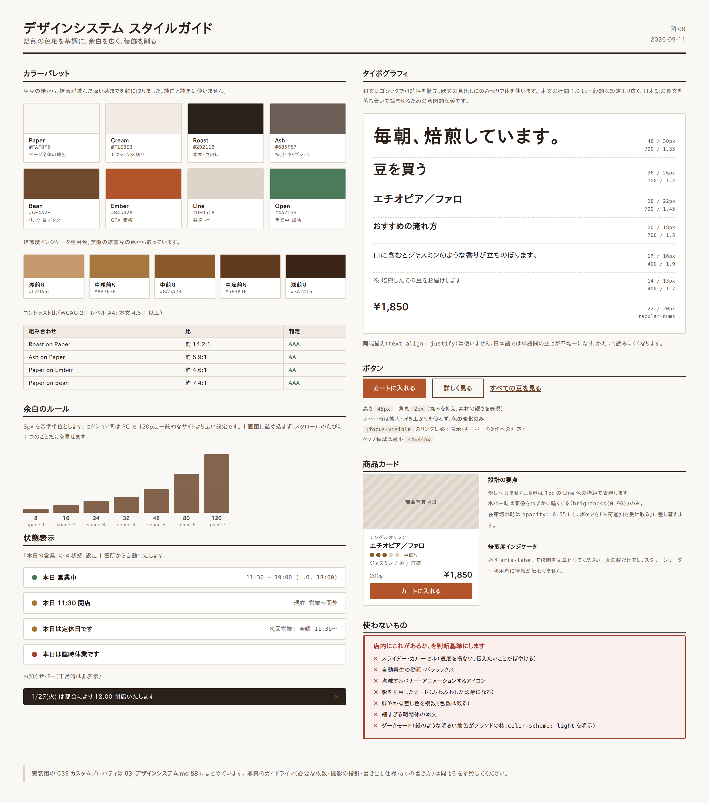

# 03. デザインシステム



## 1. デザインの方向性

実店舗の質感 —— **路地裏、木、革、焙煎機の鉄、湯気** —— をそのまま Web に持ち込みます。

| 守ること | 避けること |
|---|---|
| 余白を広く取る | 情報を詰め込む |
| 写真を大きく使う | 装飾的なイラスト・アイコンの多用 |
| 色数を絞る | 鮮やかな差し色を複数使う |
| 静止した画面 | スライダー・自動再生・パララックス |
| 読みやすい本文 | 細すぎる明朝体・小さすぎる文字 |

> **判断に迷ったら「店内にこれがあるか」を基準にします。** 店内に点滅するバナーはありません。

---

## 2. カラーパレット

焙煎の色相をそのまま基調にします。生豆の緑から、焙煎が進んだ深い茶までを軸に取りました。

### 2.1 基本色

| 用途 | 名称 | HEX | 使いどころ |
|---|---|---|---|
| 背景（基調） | Paper | `#FAF8F5` | ページ全体の地色。純白を避け、紙の質感に寄せる |
| 背景（副） | Cream | `#F1EBE3` | セクションの区切り、カード背景 |
| 文字（主） | Roast | `#2B211B` | 本文・見出し。純黒を避ける |
| 文字（副） | Ash | `#6B5F57` | 補足文、キャプション |
| 主要色 | Bean | `#6F4A2E` | リンク、見出しの装飾、ボタン |
| 強調色 | Ember | `#B4542A` | CTA ボタン、価格、重要な状態表示 |
| 罫線 | Line | `#DED5CA` | 区切り線、入力欄の枠 |

### 2.2 状態色

| 用途 | HEX | 使いどころ |
|---|---|---|
| 営業中 / 成功 | `#4A7C59` | 「本日 営業中」の点、購入完了 |
| 休業 / 注意 | `#A8762B` | 「本日は定休日」、在庫僅少 |
| エラー | `#A63D2F` | 入力エラー、在庫なし |

### 2.3 焙煎度インジケータ専用色

商品カード・詳細ページで使う焙煎度の 5 段階表示です。

| 段階 | 表示 | HEX |
|---|---|---|
| 浅煎り | ●○○○○ | `#C49A6C` |
| 中浅煎り | ●●○○○ | `#A8763F` |
| 中煎り | ●●●○○ | `#8A5A2B` |
| 中深煎り | ●●●●○ | `#5F3A1E` |
| 深煎り | ●●●●● | `#3A2416` |

> **この 5 色は、実際の焙煎豆の色から取っています。** 情報として機能すると同時に、店の専門性を視覚的に伝えます。

### 2.4 コントラスト比の検証

WCAG 2.1 レベル AA（本文 4.5:1、大きい文字 3:1）を満たすことを確認済みです。

| 組み合わせ | 比 | 判定 |
|---|---|---|
| Roast `#2B211B` on Paper `#FAF8F5` | 約 14.2:1 | AAA |
| Ash `#6B5F57` on Paper `#FAF8F5` | 約 5.9:1 | AA |
| Paper `#FAF8F5` on Ember `#B4542A` | 約 4.6:1 | AA |
| Paper `#FAF8F5` on Bean `#6F4A2E` | 約 7.4:1 | AAA |

**ヒーロー画像の上に文字を載せる場合**は、`rgba(30, 22, 16, 0.45)` 程度のオーバーレイを重ね、必ず 4.5:1 以上を確保してください。

---

## 3. タイポグラフィ

### 3.1 フォントファミリー

```css
/* 和文・欧文 共通の本文 */
--font-body:
  "Noto Sans JP",
  "Hiragino Kaku Gothic ProN", "Hiragino Sans",
  "Yu Gothic", "Meiryo", sans-serif;

/* 見出し・ロゴまわりの欧文 */
--font-display:
  "Cormorant Garamond", "Times New Roman",
  "Hiragino Mincho ProN", "Yu Mincho", serif;

/* 価格・数値 */
--font-numeric:
  "Noto Sans JP", -apple-system, sans-serif;
  font-variant-numeric: tabular-nums;
```

**方針** — 和文はゴシックで可読性を優先。欧文の見出し（店名、セクションタイトルの英字）にのみセリフ体を使い、落ち着いた印象を作ります。

**読み込み要件**

- Web フォントは **本文用 1 ファミリー・2 ウェイト（400 / 700）まで**。読み込み負荷を抑えます。
- `font-display: swap` を指定し、フォント読み込み中も文字が見える状態にする。
- 日本語 Web フォントはサブセット化する。未処理の Noto Sans JP は 4MB を超え、表示速度を著しく損ないます。

### 3.2 サイズスケール

| 用途 | PC | SP | 行間 | 太さ |
|---|---|---|---|---|
| ヒーロー見出し | 48px | 30px | 1.35 | 700 |
| ページ見出し (h1) | 36px | 26px | 1.4 | 700 |
| セクション見出し (h2) | 28px | 22px | 1.45 | 700 |
| 小見出し (h3) | 20px | 18px | 1.5 | 700 |
| 本文 | 17px | 16px | **1.9** | 400 |
| 補足・キャプション | 14px | 13px | 1.7 | 400 |
| 価格 | 22px | 20px | 1.3 | 700 |

> **本文の行間 1.9 は、一般的な設定（1.6〜1.7）より広めです。** 日本語の長文を落ち着いて読ませるための意図的な設定で、店の「静けさ」というコンセプトにも対応します。

### 3.3 文字組みの指定

```css
body {
  font-feature-settings: "palt" 1;  /* 和文の詰め */
  letter-spacing: 0.03em;
  text-align: left;                  /* 両端揃えにしない */
}
h1, h2, h3 { letter-spacing: 0.06em; }
p { line-break: strict; overflow-wrap: break-word; }
```

`text-align: justify`（両端揃え）は**使いません**。日本語では単語間の空きが不均一になり、かえって読みにくくなります。

---

## 4. 余白のルール

8px を基準単位とします。

| トークン | 値 | 用途 |
|---|---|---|
| `space-1` | 8px | アイコンと文字の間 |
| `space-2` | 16px | 要素内の余白 |
| `space-3` | 24px | カード内の padding |
| `space-4` | 32px | 要素間 |
| `space-5` | 48px | 小セクション間 |
| `space-6` | 80px | セクション間（SP） |
| `space-7` | 120px | セクション間（PC） |

> **セクション間を PC で 120px 取ります。** 一般的なサイトより広い設定です。1 画面に詰め込まず、スクロールのたびに 1 つのことだけを見せることで、落ち着いた印象を作ります。

**コンテンツ幅**

```css
--width-content: 1200px;   /* 通常 */
--width-narrow: 720px;     /* 記事本文（1行あたり 40〜45 文字に収まる） */
--gutter: 20px;            /* 画面端の余白（SP） */
```

---

## 5. コンポーネント定義

### 5.1 ボタン

| 種別 | 用途 | 背景 | 文字 | 枠線 |
|---|---|---|---|---|
| Primary | カートに入れる、購入 | `#B4542A` | `#FAF8F5` | なし |
| Secondary | 詳しく見る、豆を見る | 透明 | `#6F4A2E` | 1px `#6F4A2E` |
| Text | 補助的なリンク | 透明 | `#6F4A2E` | 下線 |

```css
.btn {
  min-height: 48px;
  padding: 14px 32px;
  border-radius: 2px;        /* ほぼ角丸なし。硬質な印象 */
  font-size: 16px;
  font-weight: 700;
  letter-spacing: 0.08em;
  transition: background-color .2s ease, color .2s ease;
}
.btn:focus-visible {
  outline: 2px solid #6F4A2E;
  outline-offset: 3px;
}
```

- 角丸は **2px**。丸みを抑え、素材の硬さを表現します。
- ホバー時は**拡大・浮き上がりを使わず**、色の変化のみ。
- フォーカスリングは必ず表示する（キーボード操作への対応）。

### 5.2 商品カード

```
┌──────────────────────┐
│                      │
│   [ 画像 4:3 ]        │   ← object-fit: cover
│                      │
├──────────────────────┤
│ シングルオリジン        │   ← 12px / Ash / 字間広め
│ エチオピア／ファロ       │   ← 18px / Roast / 700
│ ●●●○○ 中煎り          │   ← 焙煎度インジケータ
│ ジャスミン / 桃 / 紅茶   │   ← 13px / Ash
│                      │
│ 200g        ¥1,850   │   ← 価格 20px / 700
│ [  カートに入れる  ]    │
└──────────────────────┘
```

- 影は付けない。境界は 1px の `Line` 色の枠線で表現。
- ホバー時は画像をわずかに暗くする（`filter: brightness(0.96)`）のみ。
- 在庫切れ時はカード全体を `opacity: 0.55` にし、ボタンを「入荷通知を受け取る」に差し替える。

### 5.3 焙煎度インジケータ

```html
<span class="roast-level" aria-label="焙煎度: 中煎り（5段階中3）">
  <i class="on"></i><i class="on"></i><i class="on"></i><i></i><i></i>
  <span class="roast-label">中煎り</span>
</span>
```

**必ず `aria-label` で段階を文章化してください。** 丸の数だけでは、スクリーンリーダー利用者に情報が伝わりません。

### 5.4 味わいバー

```
酸味   ●●●●○
苦味   ●●○○○
コク   ●●●○○
```

- 5 段階。商品詳細ページでのみ使用（一覧では焙煎度のみに絞り、情報過多を避ける）。
- 数値ではなく記号で表す。「酸味 4」より「●●●●○」の方が直感的です。

### 5.5 お知らせバー

```
┌────────────────────────────────────────────────┐
│ 1/27(火) は都合により 18:00 閉店いたします    [×] │
└────────────────────────────────────────────────┘
```

- 背景 `#2B211B`、文字 `#FAF8F5`。
- 平常時は**非表示**。管理画面のチェックボックスで表示を制御。
- 閉じるボタンあり。閉じた状態は 24 時間保持（`localStorage`）。
- **点滅・スライドアニメーションは使わない。**

### 5.6 「本日の営業」ブロック

| 状態 | 表示 | 点の色 |
|---|---|---|
| 営業中 | 本日 営業中　11:30 – 19:00 (L.O. 18:00) | `#4A7C59` |
| 営業時間外 | 本日 11:30 開店　（現在 営業時間外） | `#A8762B` |
| 定休日 | 本日は定休日です　次回営業: 金曜 11:30〜 | `#A8762B` |
| 臨時休業 | 本日は臨時休業です | `#A63D2F` |

「次回営業」まで表示することで、**「じゃあいつ行けるのか」に同時に答えます。**

---

## 6. 写真のガイドライン

サイトの印象の大半は写真で決まります。以下を満たす素材を用意してください。

### 6.1 必要な写真

| 用途 | 枚数 | 内容 |
|---|---|---|
| ヒーロー | 1〜2 | 焙煎中の GIESEN。湯気・豆・手元が写るもの |
| 店内 | 5〜8 | カウンター、席、豆の棚、ドリップの手元、外観 |
| アクセス | 5〜6 | 駅からの道順の各ポイント |
| 商品 | 全商品 × 2〜3 | 豆のアップ、パッケージ、淹れた一杯 |
| 店主 | 1〜2 | 焙煎中／ドリップ中の姿 |
| メニュー | 3〜5 | コーヒー、チーズケーキ、ガトーショコラ |

### 6.2 撮影の指針

| 守ること | 理由 |
|---|---|
| 自然光で撮る | 店の雰囲気が最も正確に写ります |
| 白飛びさせない | 焙煎豆の質感が失われます |
| 彩度を上げすぎない | 落ち着いた色調がブランドの印象です |
| 背景を整理する | 余計なものが写ると生活感が出ます |
| 商品は同じ条件で撮る | 一覧に並べたとき、比較可能になります |

### 6.3 書き出し仕様

| 用途 | 長辺 | 形式 | 目標容量 |
|---|---|---|---|
| ヒーロー | 2000px | WebP（JPEG フォールバック） | 250KB 以下 |
| セクション画像 | 1400px | WebP | 150KB 以下 |
| 商品画像 | 1000px | WebP | 100KB 以下 |
| サムネイル | 600px | WebP | 50KB 以下 |

**すべての画像に `width` / `height` 属性を指定してください。** レイアウトのガタつき（CLS）を防ぐために必須です。

### 6.4 代替テキスト（alt）の書き方

| 悪い例 | 良い例 |
|---|---|
| `alt="画像"` | `alt="GIESEN の焙煎機で豆を焼いている様子"` |
| `alt="コーヒー"` | `alt="ハンドドリップで淹れるももぞのブレンド"` |
| `alt="IMG_2841"` | `alt="中野店のカウンター席と豆の棚"` |

装飾目的の画像は `alt=""` とし、スクリーンリーダーに読ませません。

---

## 7. アクセシビリティ要件

WCAG 2.1 レベル AA を目標とします。

| 項目 | 要件 |
|---|---|
| コントラスト | 本文 4.5:1 以上、大きい文字 3:1 以上 |
| キーボード操作 | 全機能がキーボードのみで操作可能。フォーカスリングを消さない |
| 見出し構造 | h1 → h2 → h3 の順序を守る。階層を飛ばさない |
| 画像 | すべてに適切な alt |
| フォーム | すべての入力欄に `<label>` を紐付ける |
| リンク文言 | 「こちら」「詳細」ではなく、行き先が分かる文言にする |
| 動きの抑制 | `prefers-reduced-motion` に対応し、該当時はアニメーションを無効化 |
| 言語指定 | `<html lang="ja">`（英語ページは `en`） |
| 拡大 | 200% 拡大時もレイアウトが崩れない |

---

## 8. CSS カスタムプロパティ（実装用）

```css
:root {
  /* Color */
  --c-paper:      #FAF8F5;
  --c-cream:      #F1EBE3;
  --c-roast:      #2B211B;
  --c-ash:        #6B5F57;
  --c-bean:       #6F4A2E;
  --c-ember:      #B4542A;
  --c-line:       #DED5CA;
  --c-open:       #4A7C59;
  --c-closed:     #A8762B;
  --c-error:      #A63D2F;

  /* Roast levels */
  --roast-1: #C49A6C;
  --roast-2: #A8763F;
  --roast-3: #8A5A2B;
  --roast-4: #5F3A1E;
  --roast-5: #3A2416;

  /* Typography */
  --font-body: "Noto Sans JP", "Hiragino Kaku Gothic ProN", "Yu Gothic", sans-serif;
  --font-display: "Cormorant Garamond", "Yu Mincho", serif;
  --fs-body: 17px;
  --lh-body: 1.9;

  /* Space */
  --space-1: 8px;   --space-2: 16px;  --space-3: 24px;
  --space-4: 32px;  --space-5: 48px;  --space-6: 80px;  --space-7: 120px;

  /* Layout */
  --width-content: 1200px;
  --width-narrow: 720px;
  --gutter: 20px;
  --radius: 2px;
}

@media (max-width: 767px) {
  :root { --fs-body: 16px; --space-7: 80px; --gutter: 16px; }
}

@media (prefers-reduced-motion: reduce) {
  *, *::before, *::after {
    animation-duration: .01ms !important;
    transition-duration: .01ms !important;
  }
}
```

> **ダークモードは対応しません。** 紙のような明るい地色がブランドの核であり、反転させると印象が損なわれます。`color-scheme: light` を明示し、ブラウザによる自動反転を防いでください。
