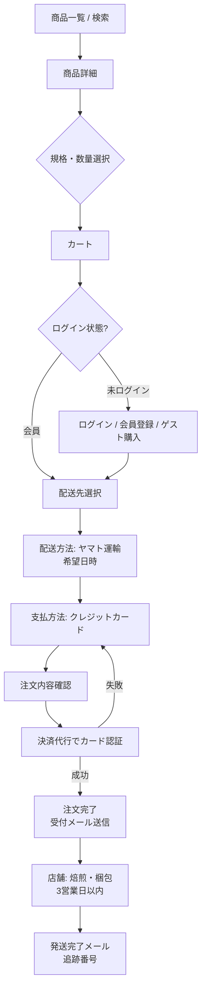

# 04. 機能・データ設計

## 1. 店舗サイト（WordPress）機能設計

### 1.1 コンテンツタイプ

| 種別 | 名称 | 用途 | 主要フィールド |
|---|---|---|---|
| 投稿（post） | News | お知らせ・新入荷・セール・スイーツ | タイトル、本文、公開日、カテゴリ、アイキャッチ、関連商品 URL（カスタムフィールド）【提案】 |
| 固定ページ（page） | トップ／About／Menu／Access | 静的ページ | ブロックエディタ本文 |
| カスタム投稿【提案】 | メニュー（menu_item） | 店内メニューを構造化管理 | 品名、区分、価格、説明、表示順、提供中フラグ |
| サイト設定【提案】 | 店舗情報 | フッター・構造化データ・営業状況表示の単一ソース | 店名、住所、電話、営業時間、定休日、臨時休業日、SNS URL、お知らせバー |

### 1.2 News カテゴリ

| スラッグ | 名称 | 現行記事の対応 |
|---|---|---|
| info | お知らせ | 年末年始、臨時休業、営業時間変更、営業再開 |
| arrival | 新入荷 | パナマ ゲイシャ、ルワンダ、ニカラグア 等 |
| sale | セール | 周年セール、お試しセール |
| sweets | スイーツ | オレンジのパウンドケーキ 等 |

### 1.3 営業状況の自動表示【提案】

```
入力: 現在日時（Asia/Tokyo）、定休日（水・木）、営業時間（11:30-19:00）、臨時休業日リスト
判定:
  1. 本日が臨時休業日 → 「本日は臨時休業」
  2. 本日が定休日     → 「本日定休日」
  3. 営業時間内       → 「営業中（L.O. 18:00）」
  4. それ以外         → 「本日の営業は終了」または「本日 11:30 開店」
出力: トップの営業案内セクション、SP 固定バー
```

年末年始などの変則営業は「臨時休業日リスト」と News の両方で管理し、二重更新を避けるため管理画面の同一フォームから News 下書きを生成できるようにする。

### 1.4 プラグイン方針（WordPress）

| 目的 | 方針 |
|---|---|
| SEO | title／description／OGP／sitemap を出力できるもの1つ |
| フォーム | お問い合わせをショップ側（EC-CUBE `/shop/contact`）に集約するなら不要 |
| キャッシュ | ページキャッシュ＋画像 WebP 変換 |
| セキュリティ | ログイン試行制限、管理画面 URL 変更またはベーシック認証 |
| バックアップ | 日次 DB＋ファイル、外部ストレージへ転送 |

## 2. オンラインショップ（EC-CUBE）機能設計

### 2.1 機能一覧

| ID | 機能 | 内容 | 現行 |
|---|---|---|---|
| S-01 | 商品管理 | 商品登録、画像、カテゴリ、規格、在庫、公開／非公開 | 標準 |
| S-02 | カテゴリ | ブレンド／シングルオリジン／カフェインレス／ギフト・器具 | 要確認（提案区分） |
| S-03 | 規格 | 挽き方（豆のまま／中挽き／細挽き）を規格1として設定【提案】 | 要確認 |
| S-04 | カート | セッション保持、会員はログイン後にマージ | 標準 |
| S-05 | 会員 | 登録、ログイン、マイページ、配送先複数登録、退会 | 標準 |
| S-06 | ゲスト購入 | 会員登録なしで購入 | 要確認 |
| S-07 | 決済 | クレジットカード（決済代行プラグイン）。カード情報は非保持 | 確認済（カード可） |
| S-08 | 配送 | ヤマト運輸宅急便、国内のみ、希望日時指定 | 確認済 |
| S-09 | 送料 | 地域別または一律。一定金額以上で無料【要確認・提案】 | 要確認 |
| S-10 | メール | 注文受付、発送完了、会員登録、パスワード再発行 | 標準 |
| S-11 | お知らせ | ショップ TOP の新着情報ブロック | 標準 |
| S-12 | 受注管理 | ステータス（新規受付→入金済→発送済→完了／キャンセル） | 標準 |
| S-13 | 検索 | 商品名・カテゴリ | 標準 |
| S-14 | お気に入り | 会員のお気に入り登録 | 標準 |
| S-15 | ギフトオプション | 包装・のし・メッセージカードを注文オプションで選択【提案】 | 要確認 |

### 2.2 購入フロー



### 2.3 受注ステータス遷移

| 状態 | 遷移条件 | 顧客メール |
|---|---|---|
| 新規受付 | 注文完了 | 注文受付メール |
| 入金済（カード決済済） | 決済代行の承認 | なし |
| 発送準備中 | 店舗で焙煎・梱包開始 | なし |
| 発送済 | 伝票番号登録 | 発送完了メール（追跡番号付き） |
| 完了 | 配達完了から一定日数 | なし |
| キャンセル | 顧客依頼または在庫切れ | キャンセル通知 |

## 3. データ設計

### 3.1 商品（Product）項目定義

| 項目 | 型 | 必須 | 説明 | 例 |
|---|---|---|---|---|
| product_id | 整数 | ○ | EC-CUBE 自動採番。URL に使用 | 12 |
| name | 文字列 | ○ | 「生産国／農園・地域」または「ブレンド名」 | ケニア／キリニャガ カムワンギ・ファクトリー |
| category | 選択 | ○ | ブレンド／シングルオリジン／カフェインレス／ギフト・器具 | シングルオリジン |
| price_incl_tax | 整数 | ○ | 税込価格（円） | 2200 |
| weight_g | 整数 | ○ | 内容量（g） | 200 |
| country | 文字列 | △ | 生産国（ブレンドは空） | ケニア |
| region | 文字列 | △ | 地域 | キリニャガ |
| farm | 文字列 | △ | 農園・ステーション | カムワンギ・ファクトリー |
| variety | 文字列 | △ | 品種 | SL28, SL34 |
| altitude | 文字列 | △ | 標高 | 1,700m |
| process | 選択 | ○ | 精製方法 | Washed／Natural／Honey 等 |
| roast_level | 選択 | ○ | 焙煎度 | ミディアム／ハイ／シティ／フルシティ／フレンチ |
| tasting_note | テキスト | ○ | 味わい | 完熟した果実やベリーの凝縮感… |
| description | テキスト | △ | 農園・生産者の紹介 | |
| image_main | 画像 | ○ | 正方形 1200px | |
| image_sub[] | 画像 | △ | 最大4枚 | |
| grind_options | 規格 | △ | 豆のまま／中挽き／細挽き【提案】 | |
| stock | 整数 or 無制限 | ○ | 在庫 | |
| status | 選択 | ○ | 公開／非公開／廃止 | |
| is_recommended | 真偽 | △ | ショップ TOP のおすすめ表示 | |
| created_at / updated_at | 日時 | ○ | | |

### 3.2 現行商品ラインナップ【確認済（価格は調査時点）】

| ID | 商品名 | 区分 | 内容量 | 税込価格 | 精製 | 焙煎度 | 味わい（要約） |
|---|---|---|---|---|---|---|---|
| 8 | ふかいりブレンド | ブレンド | 200g | 1,800円 | – | 深煎り | 要確認 |
| 10 | ももぞのブレンド | ブレンド | 200g | 1,800円 | – | シティ | 果実の爽やかな酸味と甘みのアロマ、後味すっきり |
| 11 | カフェインレス／メキシコ トリウンフォ・ベルデ | カフェインレス | 200g | 2,000円 | 要確認 | 要確認 | 要確認 |
| 12 | ケニア／キリニャガ カムワンギ・ファクトリー | シングルオリジン | 200g | 2,200円 | Washed | フレンチ | 完熟果実・ベリーの凝縮感、なめらかな酸味と甘み、深いボディと長い余韻 |
| 15 | イタリアンブレンド | ブレンド | 200g | 1,900円 | – | 要確認（極深煎り想定） | 要確認 |
| 17 | ホンジュラス／チャギテ IH-90 | シングルオリジン | 200g | 1,700円 | 要確認 | 要確認 | 要確認 |
| 20 | タンザニア／ハイツ農園 ブルーリボンAA | シングルオリジン | 200g | 1,950円 | 要確認 | 要確認 | 要確認 |
| 34 | エチオピア／ファロ | シングルオリジン | 200g | 1,850円 | 要確認 | 要確認 | 要確認 |
| 37 | エチオピア／ゴロ・ペデッサ ナチュラル | シングルオリジン | 200g | 要確認 | Natural | 要確認 | 要確認 |
| 41 | ホンジュラス／サンミゲル・デ・セルグァパ | シングルオリジン | 200g | 要確認 | 要確認 | 要確認 | 要確認 |
| 55 | グアテマラ／ウエウエテナンゴ サンタバルバラ | シングルオリジン | 200g | 1,900円 | 要確認 | 要確認 | 要確認 |

価格帯は 200g あたり 1,700〜2,200円。商品 ID が 55 まで採番されていることから、季節入替により累計 50 点以上が登録・非公開化されてきたと推定できる。

### 3.3 News（Post）項目定義

| 項目 | 型 | 必須 | 説明 |
|---|---|---|---|
| post_id | 整数 | ○ | WordPress 自動採番 |
| title | 文字列 | ○ | 記事タイトル |
| slug | 文字列 | ○ | 英数字（To-Be）。現行は日本語タイトル由来 |
| category | 選択 | ○ | info／arrival／sale／sweets |
| published_at | 日時 | ○ | 公開日 |
| body | リッチテキスト | ○ | 本文 |
| eyecatch | 画像 | △ | 一覧サムネイル |
| related_product_url | URL | △ | 新入荷記事から商品詳細へ【提案】 |
| pinned | 真偽 | △ | トップに固定表示（臨時休業など）【提案】 |

### 3.4 店舗情報（Site Settings）項目定義

| 項目 | 値（現行） |
|---|---|
| shop_name | MUTO coffee roastery |
| shop_name_kana | ムトウ コーヒー ロースタリー |
| company | 株式会社 Lounge M |
| representative | 武藤 修一郎 |
| postal_code | 164-0001 |
| address | 東京都中野区中野 3-34-18 |
| tel | 03-6382-5439 |
| email | shop@muto-coffee.com |
| open_time / close_time | 11:30 / 19:00 |
| last_order | 18:00 |
| retail_until | 19:00（豆・器具） |
| regular_holidays | 水, 木 |
| special_holidays[] | 管理画面で追加（例: 年末年始） |
| access_text | JR中央線・総武線／東京メトロ東西線 中野駅 南口 徒歩2分（中野マルイ裏） |
| map_embed | Google マップ埋め込み URL |
| instagram_url | https://www.instagram.com/mutocoffeeroastery/ |
| facebook_url | https://www.facebook.com/mutocoffeeroastery/ |
| notice_bar | 文言／リンク／表示期間 |

### 3.5 店内メニュー（MenuItem）項目定義【提案】

| 項目 | 型 | 説明 |
|---|---|---|
| name | 文字列 | 品名 |
| group | 選択 | ブレンド／シングルオリジン／アレンジ／その他ドリンク／スイーツ／セット |
| price | 整数 or 文字列 | 税込。「650円〜」「＋420円」のような表記を許容 |
| note | 文字列 | 味の説明 |
| sort_order | 整数 | 表示順 |
| available | 真偽 | 提供中 |

初期データは 03章 2.2 の表を投入する。

## 4. メール通知一覧（ショップ）

| メール | 送信契機 | 宛先 | 主要内容 |
|---|---|---|---|
| 注文受付 | 注文完了 | 顧客、店舗（shop@） | 注文番号、商品、金額、配送先、発送予定（3営業日以内） |
| 発送完了 | 発送済に変更 | 顧客 | 追跡番号、到着目安 |
| 会員登録完了 | 会員登録 | 顧客 | ログイン案内 |
| パスワード再発行 | 申請 | 顧客 | 再設定リンク（有効期限付き） |
| お問い合わせ受付 | フォーム送信 | 顧客、店舗 | 内容の控え |

## 5. 外部連携

| 連携先 | 方式 | 用途 |
|---|---|---|
| 決済代行 | EC-CUBE 決済プラグイン（トークン方式） | クレジットカード |
| ヤマト運輸 | 伝票番号手入力（初期）。件数増加時は B2 クラウド CSV 連携 | 追跡番号通知 |
| Google マップ | iframe 埋め込み | アクセス |
| Instagram | 埋め込み or 公式リンク | SNS 送客 |
| 店舗サイト⇔ショップ | ショップの新着商品を店舗トップに表示（RSS または Web API）【提案】 | 商品露出 |
