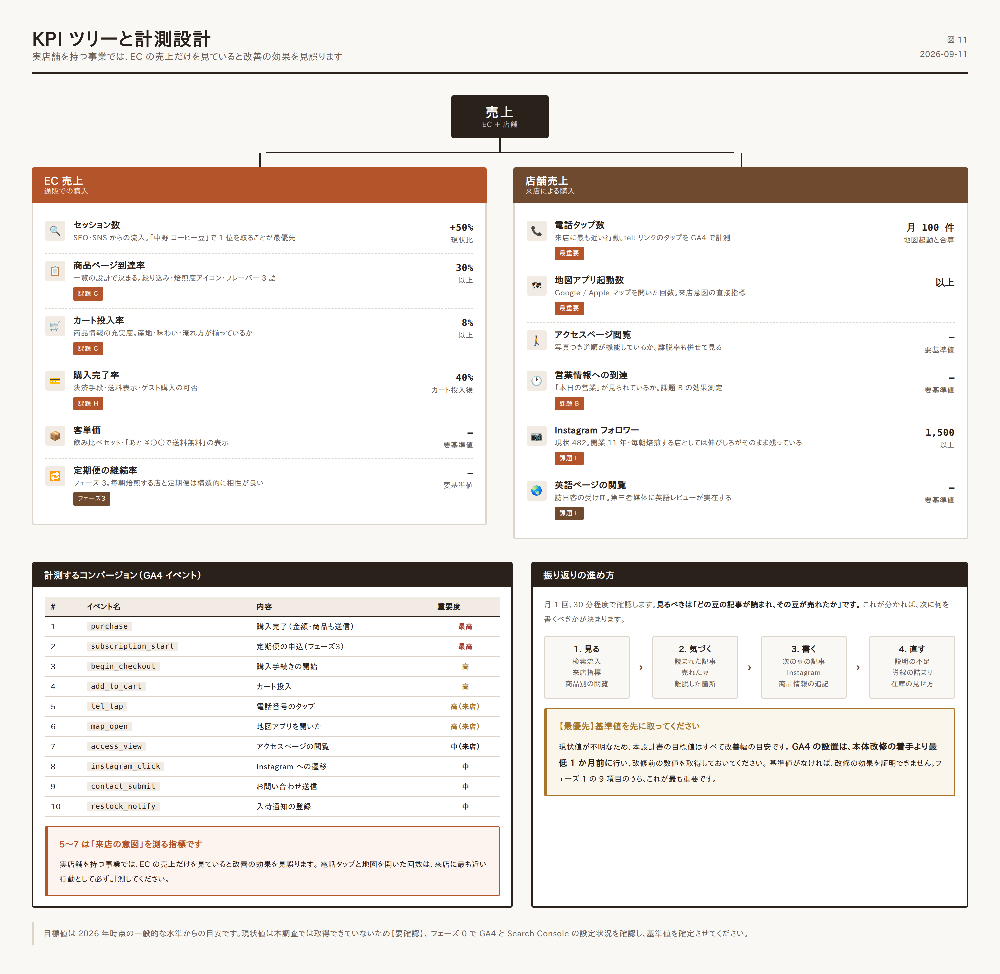

# 04. 技術要件・SEO・計測設計

## 1. 推奨技術構成

`02_サイト設計` §2 の **案 B（WordPress + WooCommerce への統合）** を前提とします。

| 領域 | 採用 | 備考 |
|---|---|---|
| CMS | WordPress 6.x 以上 | 現行資産を活かせる【推定: 現行も WordPress】 |
| EC | WooCommerce | 商品点数 10〜20 点規模に適合 |
| テーマ | オリジナル（ブロックテーマ）または軽量テーマの子テーマ | 多機能テーマは速度を損なうため避ける |
| 定期購入 | WooCommerce Subscriptions 等 | フェーズ 3 |
| 決済 | Stripe（カード）＋ Amazon Pay ＋ PayPay | |
| サーバー | PHP 8.2 以上、HTTP/2、常時 SSL | |
| CDN / キャッシュ | ページキャッシュ＋画像 CDN | |
| フォーム | Contact Form 7 または Snow Monkey Forms | |
| 予備 | WP 管理画面の 2 要素認証、自動バックアップ（日次） | |

### 使用しないもの

| 避けるもの | 理由 |
|---|---|
| ページビルダー（Elementor 等）の多用 | 出力 HTML が肥大化し、表示速度を大きく損なう |
| jQuery 依存のプラグイン | 不要な読み込みが増える |
| 自動翻訳ウィジェット | 品質が店の印象を損なう |
| スライダー・カルーセル | 設計方針（静けさ）に反し、速度も落ちる |
| フォントアイコン（Font Awesome 全体読み込み） | 必要な数個は SVG を直接埋め込む |

---

## 2. サイト移行時のリダイレクト設計【必須】

**これを怠ると、検索流入と外部リンクを失います。** 移行作業で最も重要な工程です。

### 2.1 ドメインの正規化

```apache
# www あり → なし（301）
RewriteCond %{HTTP_HOST} ^www\.muto-coffee\.com$ [NC]
RewriteRule ^(.*)$ https://muto-coffee.com/$1 [R=301,L]
```

### 2.2 旧 EC-CUBE URL の対応表

確認できた商品 ID から、最低限この対応表が必要です【要確認: 全 ID を棚卸しすること】。

| 旧 URL | 新 URL |
|---|---|
| `/shop/products/detail/8` | `/beans/fukairi-blend/` |
| `/shop/products/detail/10` | `/beans/momozono-blend/` |
| `/shop/products/detail/11` | `/beans/decaf-mexico-triunfo-verde/` |
| `/shop/products/detail/12` | `/beans/kenya-kirinyaga-kamwangi/` |
| `/shop/products/detail/15` | `/beans/italian-blend/` |
| `/shop/products/detail/17` | `/beans/honduras-chaguite-ih90/` |
| `/shop/products/detail/20` | `/beans/tanzania-heights-blue-ribbon-aa/` |
| `/shop/products/detail/34` | `/beans/ethiopia-faro/` |
| `/shop/products/detail/37` | `/beans/ethiopia-goro-bedessa-natural/` |
| `/shop/products/detail/41` | `/beans/honduras-san-miguel-de-cerguapa/` |
| `/shop/products/detail/55` | `/beans/guatemala-huehuetenango-santa-barbara/` |
| `/shop/` | `/beans/` |
| `/shop/help/about` | `/about-shop/` |
| `/shop/help/tradelaw` | `/legal/tradelaw/` |

### 2.3 日本語スラッグ記事の扱い

現在の News 記事は日本語がそのままスラッグになっています【確認済】。

```
現状: https://muto-coffee.com/ルワンダ・コアカカ-ムガンザ/
      → 実際には %E3%83%AB%E3%83%AF... と長大にエンコードされる
```

**問題点** — SNS で共有したときに URL が壊れて見える、アクセス解析でページが判別しにくい、外部ツールとの連携で不具合が出やすい。

**対応** — 新規記事は英数字スラッグにします。既存記事は**変更せず 301 でつなぐ**か、そのまま残します。

```
新: /journal/beans/rwanda-koakaka-muganza/
旧: /ルワンダ・コアカカ-ムガンザ/  → 301 → 新
```

> **既存記事のスラッグを 301 なしで変更してはいけません。** 検索順位と被リンクを失います。

### 2.4 移行チェック

- [ ] 移行前に全 URL の一覧を取得（`tools/capture_site.py` または Screaming Frog 等）
- [ ] 対応表を作成し、リダイレクトを設定
- [ ] 公開後、旧 URL をすべて巡回し 301 が効いているか確認
- [ ] Google Search Console に新サイトマップを送信
- [ ] 公開後 4 週間、Search Console のカバレッジエラーを監視

---

## 3. 構造化データ（JSON-LD）

### 3.1 店舗情報 — 課題 B の技術的解決

全ページに出力します。**「本日の営業」ブロックと同じ設定値から生成してください。**

```json
{
  "@context": "https://schema.org",
  "@type": "CafeOrCoffeeShop",
  "@id": "https://muto-coffee.com/#shop",
  "name": "MUTO coffee roastery",
  "alternateName": "ムトウ コーヒー ロースタリー",
  "url": "https://muto-coffee.com/",
  "telephone": "+81-3-6382-5439",
  "image": "https://muto-coffee.com/images/shop-exterior.jpg",
  "priceRange": "¥¥",
  "servesCuisine": "Coffee",
  "address": {
    "@type": "PostalAddress",
    "streetAddress": "中野3-34-18",
    "addressLocality": "中野区",
    "addressRegion": "東京都",
    "postalCode": "164-0001",
    "addressCountry": "JP"
  },
  "geo": {
    "@type": "GeoCoordinates",
    "latitude": "【要確認: 実測値を入れる】",
    "longitude": "【要確認: 実測値を入れる】"
  },
  "openingHoursSpecification": [
    {
      "@type": "OpeningHoursSpecification",
      "dayOfWeek": ["Monday","Tuesday","Friday","Saturday","Sunday"],
      "opens": "11:30",
      "closes": "19:00"
    }
  ],
  "sameAs": [
    "https://www.instagram.com/mutocoffeeroastery/",
    "https://www.facebook.com/mutocoffeeroastery/"
  ]
}
```

> **【要確認】** 営業時間・定休日は媒体間で食い違っています（`01_現状分析` 課題 B）。**店舗に確認して確定した値**を入れてください。ここが正しくないと、Google 上の表示も誤り続けます。
> 臨時休業日は `specialOpeningHoursSpecification` で個別に指定できます。

### 3.2 商品情報

各商品詳細ページに出力します。

```json
{
  "@context": "https://schema.org",
  "@type": "Product",
  "name": "エチオピア／ファロ",
  "image": ["https://muto-coffee.com/images/beans/ethiopia-faro.jpg"],
  "description": "ジャスミンのような香りと、桃を思わせる甘さ。中煎り。",
  "brand": { "@type": "Brand", "name": "MUTO coffee roastery" },
  "offers": {
    "@type": "Offer",
    "url": "https://muto-coffee.com/beans/ethiopia-faro/",
    "priceCurrency": "JPY",
    "price": "1850",
    "availability": "https://schema.org/InStock",
    "seller": { "@type": "Organization", "name": "株式会社 Lounge M" }
  }
}
```

### 3.3 記事

ジャーナル記事には `Article`、パンくずには `BreadcrumbList` を出力します。

### 3.4 検証

実装後、以下で必ず検証してください。

- Google リッチリザルトテスト
- Schema.org Validator
- Google Search Console の「拡張」レポート

---

## 4. SEO 設計

### 4.1 タイトル・メタディスクリプションの設計

| ページ | title | description |
|---|---|---|
| トップ | MUTO coffee roastery｜中野の自家焙煎コーヒー豆店 | 中野駅から徒歩3分。オランダ GIESEN の焙煎機で毎朝焙煎するスペシャルティコーヒー専門店。常時10〜15種類の豆を販売、店内では淹れたての一杯と自家製ケーキを。 |
| 豆一覧 | コーヒー豆一覧｜MUTO coffee roastery | 焙煎度・味わい・産地から選べる自家焙煎コーヒー豆。ブレンドからシングルオリジン、カフェインレスまで常時10種類以上。全国発送。 |
| 商品詳細 | {商品名}｜コーヒー豆｜MUTO coffee roastery | {フレーバー3語}。{焙煎度}。{産地の特徴を1文}。200g ¥{価格}。中野の自家焙煎店から焙煎したての豆をお届けします。 |
| 店舗案内 | 店舗案内・アクセス｜MUTO coffee roastery | 中野駅南口から徒歩3分、れんが坂を上った路地裏。営業時間11:30〜19:00、定休日は水曜・木曜。駅からの道順を写真でご案内します。 |
| MUTOについて | MUTOについて｜中野の自家焙煎コーヒー店 | 2014年、中野の路地裏に開業。オランダ GIESEN の焙煎機で毎朝焙煎しています。店主の経歴と、豆を選ぶ基準について。 |
| ジャーナル | ジャーナル｜MUTO coffee roastery | 入荷した豆の紹介、焙煎の話、おいしい淹れ方。中野の自家焙煎コーヒー店からのお便りです。 |

**ルール**

- title は **32 文字前後**（検索結果で省略されない長さ）。
- description は **90〜120 文字**。
- **全ページで「MUTO coffee roastery」の綴りを統一する**（現在 News ページが「roastary」と誤記【確認済】）。
- description に必ず「中野」を入れる。地域検索が主要な流入経路になります。

### 4.2 狙うキーワード

詳細は `data/keyword_plan.csv`。主要なものは以下です。

| 優先 | キーワード | 意図 | 受け皿 |
|---|---|---|---|
| 最高 | 中野 コーヒー豆 | 地域 × 購買 | トップ / 豆一覧 |
| 最高 | 中野 自家焙煎 | 地域 × 専門性 | トップ / MUTOについて |
| 高 | 中野 カフェ 落ち着く | 地域 × 来店 | 店舗案内 |
| 高 | 中野 スペシャルティコーヒー | 地域 × 専門性 | 豆一覧 |
| 高 | コーヒー豆 通販 スペシャルティ | 全国 × 購買 | 豆一覧 |
| 中 | エチオピア コーヒー 豆 通販 | 産地指名 | 各商品詳細 |
| 中 | カフェインレス コーヒー豆 おいしい | ニーズ | カフェインレス商品 |
| 中 | コーヒー 焙煎度 違い | 情報収集 | ジャーナル（淹れかた） |
| 中 | ハンドドリップ 淹れ方 コツ | 情報収集 | ジャーナル（淹れかた） |
| 中 | コーヒー豆 保存方法 | 情報収集 | ジャーナル（淹れかた） |
| 低 | nakano coffee roastery | 訪日客 | /en/ |

> **「中野 ○○」で確実に 1 位を取ることが最優先です。** 全国規模のキーワードで大手と競うより、地域で圧倒的な存在になる方が、来店と通販の両方に効きます。

### 4.3 内部リンク設計

```
トップ ──→ 豆一覧 ──→ 商品詳細
  │          ↑            │
  │          └────────────┘（関連商品）
  │
  ├──→ ジャーナル記事 ──→ 商品詳細 ★最重要
  │         ↑                 │
  │         └─────────────────┘（関連記事）
  │
  ├──→ 店舗案内 ──→ アクセス
  └──→ MUTOについて ──→ 焙煎について ──→ 豆一覧
```

**★ が付いた「記事 → 商品」の導線が、本改善の中核です。** 記事で豆に興味を持った読者を、そのまま購入につなげます。現状はこの導線が存在しません（課題 A・D）。

### 4.4 その他の SEO 要件

| 項目 | 要件 |
|---|---|
| XML サイトマップ | 自動生成し Search Console に送信 |
| robots.txt | サイトマップの場所を明記。カート・マイページは `noindex` |
| canonical | 全ページに自己参照 canonical を出力 |
| パンくず | 全下層ページに設置＋構造化データ |
| 404 ページ | 独自ページを用意し、豆一覧とトップへの導線を置く |
| 画像 | ファイル名を英数字の意味のある名前に（`IMG_2841.jpg` → `ethiopia-faro-beans.jpg`） |
| Google ビジネスプロフィール | サイトと**同一の**営業時間・電話・住所を登録し、常に同期させる |

> **Google ビジネスプロフィールの整備は、地域検索において公式サイトと同等以上に重要です。** 課題 B の情報不一致は、ここが未整備であることも一因と考えられます【推定】。

---

## 5. 表示速度の要件

### 5.1 目標値（Core Web Vitals）

| 指標 | 目標 | 意味 |
|---|---|---|
| LCP | 2.5 秒以下 | 主要な要素が表示されるまで |
| INP | 200ms 以下 | 操作への反応 |
| CLS | 0.1 以下 | レイアウトのずれ |
| ページ総容量 | 1.5MB 以下（トップ） | |
| リクエスト数 | 50 以下（トップ） | |

**測定方法** — PageSpeed Insights のモバイル計測。実装完了時とリリース後 1 か月時点で測定し、記録します。

### 5.2 実装要件

| 項目 | 要件 |
|---|---|
| 画像形式 | WebP を第一候補、JPEG をフォールバック |
| 画像の遅延読み込み | ファーストビュー外は `loading="lazy"` |
| ファーストビューの画像 | `fetchpriority="high"` を指定し、`lazy` にしない |
| 画像の寸法指定 | 全画像に `width` / `height`（CLS 対策） |
| フォント | サブセット化＋ `font-display: swap` ＋ `preload` |
| CSS | クリティカル CSS をインライン化、残りは遅延読み込み |
| JavaScript | `defer` 属性。不要なプラグインの JS を停止 |
| Google マップ | 遅延読み込み（クリックで初めて読み込む方式を推奨） |
| Instagram 埋め込み | 公式スクリプトは重いため、**画像を静的に取得して表示する方式**を推奨 |
| キャッシュ | ページキャッシュ有効化。静的ファイルは長期キャッシュ |

> **Instagram の公式埋め込みは 1 つで 500KB 前後を消費することがあります。** 直近 6 枚の画像を定期取得して静的に表示する方式にすれば、見た目を保ったまま速度を維持できます。

---

## 6. 計測設計

### 6.1 導入するもの

| ツール | 目的 |
|---|---|
| Google Analytics 4 | 行動分析・コンバージョン計測 |
| Google Search Console | 検索流入の把握、インデックス監視 |
| Google タグマネージャー | タグの一元管理 |
| Google ビジネスプロフィール インサイト | 地域検索からの来店行動 |

### 6.2 計測するコンバージョン

| # | イベント名 | 内容 | 重要度 |
|---|---|---|---|
| 1 | `purchase` | 購入完了（金額・商品も送信） | 最高 |
| 2 | `begin_checkout` | 購入手続きの開始 | 高 |
| 3 | `add_to_cart` | カート投入 | 高 |
| 4 | `subscription_start` | 定期便の申込（フェーズ3） | 最高 |
| 5 | `tel_tap` | 電話番号のタップ | 高（来店指標） |
| 6 | `map_open` | 地図アプリを開いた | 高（来店指標） |
| 7 | `access_view` | アクセスページの閲覧 | 中（来店指標） |
| 8 | `instagram_click` | Instagram への遷移 | 中 |
| 9 | `contact_submit` | お問い合わせ送信 | 中 |
| 10 | `restock_notify` | 入荷通知の登録 | 中 |

> **5〜7 は「来店の意図」を測る指標です。** 実店舗を持つ事業では、EC の売上だけを見ていると改善の効果を見誤ります。**電話タップと地図を開いた回数**は、来店に最も近い行動として必ず計測してください。

### 6.3 KPI 設計



```
売上
├─ EC 売上
│   ├─ セッション数        ← SEO・SNS
│   ├─ 商品ページ到達率     ← 一覧の設計（課題 C）
│   ├─ カート投入率        ← 商品情報の充実度
│   ├─ 購入完了率          ← 決済手段・送料表示（課題 H）
│   └─ 客単価              ← セット商品・送料無料ライン
│
└─ 店舗売上
    ├─ 来店意図指標        ← 電話タップ・地図起動
    ├─ アクセスページ閲覧    ← 道順の分かりやすさ
    └─ 営業情報の到達       ← 「本日の営業」表示（課題 B）
```

### 6.4 目標値（リリース 6 か月後）

**【要確認】** 現状値が不明なため、以下は改善幅の目安です。実装前に GA4 で現状を計測し、確定させてください。

| 指標 | 目安 |
|---|---|
| 自然検索セッション | 現状比 +50% |
| 商品ページ到達率 | 30% 以上 |
| カート投入率 | 8% 以上 |
| 購入完了率（カート投入後） | 40% 以上 |
| 電話タップ + 地図起動 | 月 100 件以上 |
| Instagram フォロワー | 1,500 以上（現状 482） |

---

## 7. セキュリティ・保守

| 項目 | 要件 |
|---|---|
| 常時 SSL | HSTS を有効化 |
| 管理画面 | 2 要素認証、ログイン試行回数の制限、URL の変更 |
| 更新 | WordPress 本体・プラグインを月次で更新 |
| バックアップ | 日次自動。復元手順を文書化しておく |
| 決済 | カード情報を自社サーバーに保持しない（Stripe 等のトークン方式） |
| プライバシーポリシー | Cookie 利用・アクセス解析について明記 |
| 個人情報 | 注文データの保管期間と廃棄方針を定める |

> **【最優先の確認事項】** 現行 EC-CUBE のバージョンを確認してください。2 系・3 系はサポートが終了しており、**カード決済を扱うサイトとして重大なリスク**があります。この確認結果によっては、デザイン改善よりも移行を先行させる判断が必要です。

---

## 8. 公開前チェックリスト

### 表示・動作
- [ ] 主要ブラウザ（Chrome / Safari / Edge / Firefox）で表示確認
- [ ] iOS Safari / Android Chrome で表示確認
- [ ] 画面幅 320px で横スクロールが発生しない
- [ ] 全ページのリンク切れがない
- [ ] フォームの送信と自動返信が動作する
- [ ] カート投入から購入完了までを実際に通す（テスト決済）

### SEO・移行
- [ ] 全ページに title / description / canonical
- [ ] 「roastery」の綴りが全ページで正しい
- [ ] 旧 URL からの 301 が全件動作
- [ ] XML サイトマップを Search Console に送信
- [ ] 構造化データがリッチリザルトテストを通過
- [ ] `noindex` が意図しないページに付いていない

### 情報の正確性
- [ ] 営業時間・定休日が店舗の実態と一致（**要ヒアリング**）
- [ ] 全商品の価格が現行価格と一致（**要ヒアリング**）
- [ ] 電話番号・住所・郵便番号が正しい
- [ ] 特商法表記が最新の内容
- [ ] Google ビジネスプロフィールとサイトの情報が一致

### 性能・品質
- [ ] PageSpeed Insights モバイルで LCP 2.5 秒以下
- [ ] 全画像に alt と width / height
- [ ] キーボードのみで全機能が操作できる
- [ ] GA4 のイベントが正しく発火する
