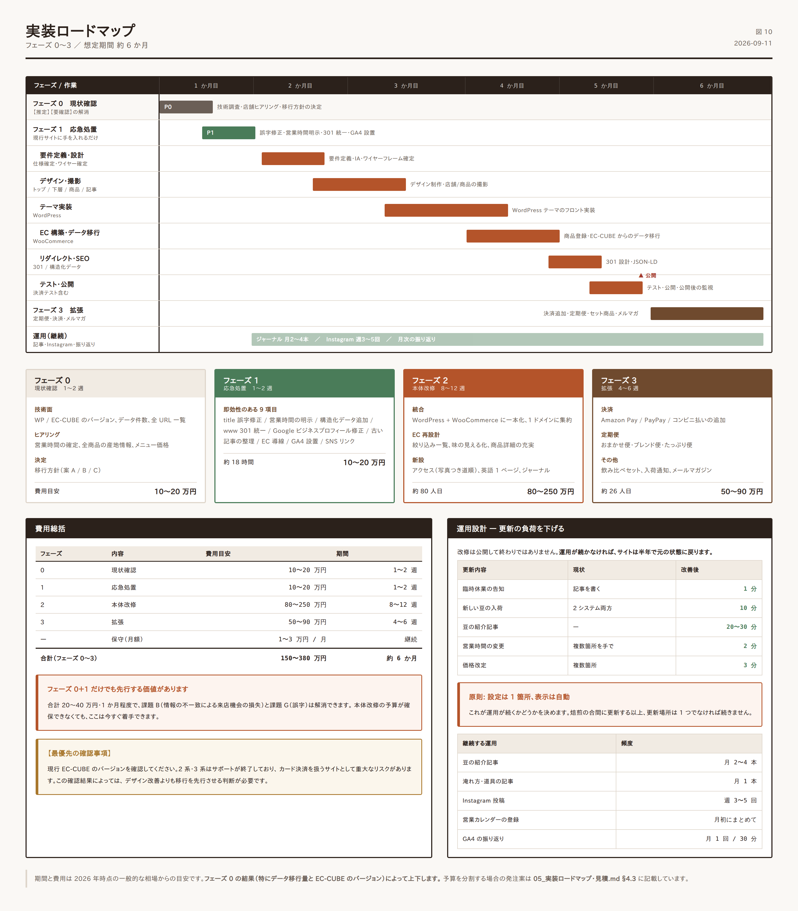

# 05. 実装ロードマップ・見積



## 1. フェーズ構成

改修を 3 つのフェーズに分けます。**フェーズ 1 は単独で先行して実施でき、即効性があります。**

| フェーズ | 名称 | 期間目安 | 狙い |
|---|---|---|---|
| **0** | 現状確認 | 1〜2 週 | 【推定】【要確認】の解消。移行方針の確定 |
| **1** | 応急処置 | 1〜2 週 | 低コストで確実な損失を止める |
| **2** | 本体改修 | 8〜12 週 | サイト統合と EC 再設計 |
| **3** | 拡張 | 4〜6 週 | 定期便・決済拡充・多言語 |

---

## 2. フェーズ 0: 現状確認（1〜2 週）

**設計を実装に移す前に、必ずここを通してください。** 本設計書には【推定】【要確認】のラベルが付いた項目があり、それらが確定しないと工数も方針も定まりません。

### 2.1 技術面の確認

| # | 確認事項 | 確認方法 | 判断への影響 |
|---|---|---|---|
| 1 | WordPress のバージョン・テーマ・プラグイン一覧 | 管理画面 | 移行工数 |
| 2 | **EC-CUBE のメジャーバージョン** | 管理画面またはソース | **最重要。2/3 系ならセキュリティ対応を最優先** |
| 3 | 商品データの件数と項目 | 管理画面 | 移行工数 |
| 4 | 顧客データ・注文履歴の件数 | 管理画面 | 移行工数・個人情報の扱い |
| 5 | サーバー環境（PHP バージョン、容量） | 契約情報 | 移行可否 |
| 6 | 全 URL の一覧 | `tools/capture_site.py` またはクロールツール | リダイレクト設計 |
| 7 | 現状の GA4 / Search Console 設定 | 各管理画面 | 効果測定の基準値 |
| 8 | 画像素材の保有状況（元データの有無） | ヒアリング | 撮影の要否 |

### 2.2 店舗へのヒアリング項目

| # | 項目 | なぜ必要か |
|---|---|---|
| 1 | **営業時間・定休日の正確な現行値** | 媒体間で食い違っている（課題 B）。すべての起点 |
| 2 | 年末年始・臨時休業の運用ルール | 営業カレンダーの設計 |
| 3 | 店内メニューの全品目と現行価格 | メニューページ |
| 4 | 全商品の産地情報（国／地区／農園／標高／品種／精製） | 商品詳細の設計（課題 C）。**店舗しか持っていない情報** |
| 5 | 全商品のフレーバーノート（3 語）と焙煎度 | 一覧の絞り込み |
| 6 | 席数・Wi-Fi・電源・喫煙・支払方法 | 店舗案内 |
| 7 | 現在の月間受注数・客単価 | 効果測定の基準値 |
| 8 | 定期便への意向（対応可能な発送頻度・数量） | フェーズ 3 の設計 |
| 9 | 卸売の有無と受付方針 | お問い合わせの設計 |
| 10 | 撮影の可否と希望日 | 素材準備 |

> **項目 4・5 は全商品分が必要です。** 入力用のフォーマットを `data/products.csv` に用意しました。店舗に記入してもらってください。ここが埋まらないと、課題 C（豆を選べない）は解決できません。

### 2.3 このフェーズの成果物

- 現状仕様書（技術構成・全 URL 一覧・データ件数）
- ヒアリング結果（確定した営業時間・全商品情報）
- 移行方針の決定（案 A / B / C のいずれか）
- リダイレクト対応表の初版

---

## 3. フェーズ 1: 応急処置（1〜2 週）

**現行サイトに手を入れるだけで実施できます。** 本体改修を待たずに先行してください。

| # | 作業 | 対応する課題 | 工数目安 | 効果 |
|---|---|---|---|---|
| 1 | News ページの title を「roastary」→「roastery」に修正 | G | 0.5 時間 | 品質印象 |
| 2 | 営業時間・定休日をトップの目立つ位置に明記 | B | 2 時間 | **来店機会の回復** |
| 3 | 構造化データ（`CafeOrCoffeeShop`）を追加 | B | 3 時間 | 検索結果での正確な表示 |
| 4 | www あり／なしの 301 統一 | A | 2 時間 | SEO 評価の集約 |
| 5 | Google ビジネスプロフィールの情報を修正・同期 | B | 2 時間 | **地域検索での正確な表示** |
| 6 | コロナ関連の古い記事を整理（非公開または注記） | D | 1 時間 | 情報の鮮度 |
| 7 | トップからショップへの導線を明確化 | A | 2 時間 | EC 流入 |
| 8 | GA4 とイベント計測を設置（基準値の取得開始） | — | 4 時間 | **以降の効果測定の前提** |
| 9 | Instagram へのリンクを全ページのフッターに追加 | E | 1 時間 | SNS 送客 |

**合計: 約 18 時間（2〜3 人日）**

> **#8 は最優先で実施してください。** 改修前の数値がなければ、改修の効果を証明できません。フェーズ 2 の着手より **最低 1 か月前**に設置し、基準値を取得しておくのが理想です。

---

## 4. フェーズ 2: 本体改修（8〜12 週）

### 4.1 作業内訳

| # | 作業 | 工数目安（人日） |
|---|---|---|
| 1 | 要件定義・仕様確定 | 5 |
| 2 | 情報設計・ワイヤーフレーム確定 | 4 |
| 3 | デザイン（トップ／下層／商品／記事） | 12 |
| 4 | 撮影（店舗・商品・道順） | 2 |
| 5 | WordPress テーマ実装 | 15 |
| 6 | WooCommerce 構築・商品登録 | 8 |
| 7 | 「本日の営業」自動判定機能の実装 | 3 |
| 8 | 豆一覧の絞り込み機能の実装 | 4 |
| 9 | EC-CUBE からのデータ移行 | 5 |
| 10 | リダイレクト設定・検証 | 3 |
| 11 | 構造化データ・SEO 設定 | 3 |
| 12 | 英語ページ作成 | 2 |
| 13 | 表示速度の最適化 | 3 |
| 14 | テスト（表示・決済・フォーム） | 5 |
| 15 | 公開作業・公開後の監視 | 3 |
| 16 | 運用マニュアル作成・引き継ぎ | 3 |

**合計: 約 80 人日**

### 4.2 費用感

| 発注先 | 目安 | 備考 |
|---|---|---|
| 制作会社（中規模） | 150〜250 万円 | 撮影・ディレクション込み |
| 制作会社（小規模）・フリーランス | 80〜150 万円 | 撮影は別途手配の場合あり |
| 段階発注（フェーズ 2 を分割） | 各 40〜80 万円 | 予算を分散できる |

> 金額は 2026 年時点の一般的な相場からの目安です。**フェーズ 0 の結果（特にデータ移行量と EC-CUBE のバージョン）によって上下します。**

### 4.3 段階発注する場合の分割案

予算を一度に確保できない場合、以下の順で分割できます。

```
2-a: コーポレート側の刷新（トップ・店舗案内・About・ジャーナル）  約 35 人日
     → ショップは現行のまま残し、デザインだけ寄せる

2-b: EC の再構築と統合（豆一覧・商品詳細・移行・リダイレクト）    約 35 人日
     → ここでサイトが 1 つになる

2-c: 仕上げ（英語ページ・速度最適化・計測）                     約 10 人日
```

**2-a を先に実施しても効果は出ます**が、課題 A（分断）の解消は 2-b まで完了しません。

---

## 5. フェーズ 3: 拡張（4〜6 週）

| # | 作業 | 対応する課題 | 工数目安 |
|---|---|---|---|
| 1 | 決済手段の追加（Amazon Pay / PayPay / コンビニ払い） | H | 4 人日 |
| 2 | 定期便の設計・実装 | H | 10 人日 |
| 3 | 飲み比べセット・ギフト商品の設計 | C | 3 人日 |
| 4 | 入荷通知メールの仕組み | C | 3 人日 |
| 5 | メールマガジン（新入荷の案内） | D・E | 4 人日 |
| 6 | Instagram 連携の強化 | E | 2 人日 |

**合計: 約 26 人日 / 50〜90 万円**

> **定期便が最も投資対効果が高い施策です。** 一度獲得した顧客が継続的に購入する構造を作れるため、フェーズ 3 の中では優先度が最も高くなります。

---

## 6. 運用設計（公開後）

改修は公開して終わりではありません。**運用が続かなければ、サイトは半年で元の状態に戻ります。**

### 6.1 更新の負荷を下げる設計

| 更新内容 | 現状 | 改善後 | 所要時間 |
|---|---|---|---|
| 臨時休業の告知 | 記事を書く | 管理画面でチェックを入れる | 1 分 |
| 新しい豆の入荷 | WordPress と EC-CUBE の両方 | 商品を登録すると一覧に自動反映 | 10 分 |
| 豆の紹介記事 | — | テンプレートに沿って書く | 20〜30 分 |
| 営業時間の変更 | 複数箇所を手で修正 | 設定 1 箇所を変更 → 全箇所に反映 | 2 分 |
| 価格改定 | 複数箇所 | 商品データ 1 箇所 | 3 分 |

> **「設定は 1 箇所、表示は自動」** を全体の原則とします。これが運用が続くかどうかを決めます。

### 6.2 更新の頻度目安

| 内容 | 頻度 | 担当 |
|---|---|---|
| 豆の紹介記事 | 月 2〜4 本 | 店主 |
| 淹れ方・道具の記事 | 月 1 本 | 店主または外注 |
| Instagram 投稿 | **週 3〜5 回** | 店主 |
| 商品の在庫更新 | 随時 | 店主 |
| 営業カレンダーの登録 | 月初にまとめて | 店主 |
| プラグイン更新・バックアップ確認 | 月 1 回 | 保守業者 |
| GA4 の確認・振り返り | 月 1 回 | 店主＋業者 |

### 6.3 Instagram 運用の具体案 — 課題 E への対応

現状はフォロワー 482・投稿 9 件【確認済】。この店の素材の豊かさを考えると、伸びしろがそのまま残っています。

**毎日撮れるもの**

| 曜日の目安 | 内容 | 撮影の手間 |
|---|---|---|
| 焙煎した日 | GIESEN で焼いている様子、焼き上がった豆 | 30 秒 |
| 入荷した日 | 生豆の袋、産地の情報 | 30 秒 |
| いつでも | ドリップの手元、湯気 | 30 秒 |
| いつでも | ケーキと一杯 | 30 秒 |
| 週 1 | 豆の紹介（記事へ誘導） | 3 分 |

**運用のルール**

- **完璧な写真を目指さない。** 続くことの方が重要です。
- 投稿文には必ず **#中野カフェ #中野コーヒー #自家焙煎** など地域タグを入れる。
- プロフィール欄のリンクは**豆一覧ページ**に設定する（トップではなく）。
- 豆の紹介記事を書いたら、必ず Instagram でも告知する。

### 6.4 振り返りの進め方

月 1 回、以下を確認します。所要 30 分程度です。

1. 自然検索のセッション数（前月比）
2. 電話タップ数・地図起動数（来店指標）
3. 商品ページの閲覧数（どの豆が見られているか）
4. カート投入率・購入完了率
5. 記事ごとの閲覧数（どの話題が読まれているか）
6. Instagram のフォロワー増減

**見るべきは「どの豆の記事が読まれ、その豆が売れたか」です。** これが分かれば、次に何を書くべきかが決まります。

---

## 7. 費用総括

| フェーズ | 内容 | 費用目安 | 期間 |
|---|---|---|---|
| 0 | 現状確認 | 10〜20 万円 | 1〜2 週 |
| 1 | 応急処置 | 10〜20 万円 | 1〜2 週 |
| 2 | 本体改修 | 80〜250 万円 | 8〜12 週 |
| 3 | 拡張 | 50〜90 万円 | 4〜6 週 |
| — | 保守（月額） | 1〜3 万円／月 | 継続 |

**フェーズ 0＋1 だけでも先行実施する価値があります。** 合計 20〜40 万円・1 か月程度で、課題 B（情報の不一致による来店機会の損失）と課題 G（誤字）は解消できます。

---

## 8. 確認事項チェックリスト

実装着手前に、本設計書の【推定】【要確認】をすべて潰してください。

### 【推定】— 現物確認が必要

- [ ] コーポレートサイトは WordPress か（バージョン・テーマ・プラグイン）
- [ ] ショップは EC-CUBE か（**メジャーバージョン**）
- [ ] 2 システム間の連携の有無
- [ ] 記事から商品へのリンクが存在するか
- [ ] 商品一覧に絞り込み機能があるか
- [ ] 英語ページが存在しないこと
- [ ] ゲスト購入の可否
- [ ] 送料・送料無料ラインの設定
- [ ] 挽き方の指定が可能か
- [ ] Google ビジネスプロフィールの整備状況

### 【要確認】— 店舗へのヒアリングが必要

- [ ] 営業時間の正確な現行値（19:00 か 19:30 か、L.O. は何時か）
- [ ] 定休日の正確な現行値（水・木か、木＋第1第3水か）
- [ ] 店内メニューの全品目と現行価格
- [ ] 全商品の産地情報（`data/products.csv` に記入）
- [ ] 全商品のフレーバーノートと焙煎度
- [ ] 席数・Wi-Fi・電源・喫煙・支払方法
- [ ] 店舗の緯度・経度（構造化データ用）
- [ ] 現在の月間受注数・客単価
- [ ] 定期便への意向
- [ ] 卸売の受付方針

### 取得できなかった情報（本セッションの環境制約）

- [ ] 現行サイトのスクリーンショット → `tools/capture_site.py` をローカルで実行
- [ ] 掲載画像の実体と最適化状況 → 同上
- [ ] HTML / CSS ソース → 同上
- [ ] Core Web Vitals の実測値 → PageSpeed Insights で測定
